# Academy Gaps Ranks 1–10 — Implementation Plan

## Architecture overview

```mermaid
flowchart TD
    subgraph DB [Supabase DB migrations]
        M1["Migration: device_push_tokens table"]
        M2["Migration: academy_invites table"]
        M4["Migration: backfill academy_id on coach_students"]
    end

    subgraph Code [Code changes]
        C1fix["supabase.js: addStudentByCode writes academy_id on insert"]
    end

    subgraph AppLayer [App changes]
        subgraph CoachOps [Coach / student ops]
            C1["C-1: AssignProgramListScreen — academy-scoped query"]
            C2["C-2: Academy context card in CoachDashboardScreen"]
            C4["C-4: MainTabNavigator — fix Academy tab gate"]
            C5["C-5: CreateCoachProfileScreen — fix is_active label"]
        end
        subgraph OwnerOps [Academy owner controls]
            AO1["AO-1: Academy-wide student roster (My Academy tab)"]
            AO2["AO-2: Remove member + change role (My Academy tab)"]
            AO3["AO-3: Unpublish program (ProgramsTable)"]
            AO4["AO-4: Academy settings (name, logo) — My Academy tab"]
            AO5["AO-5: Invite link/token flow"]
        end
        subgraph FCM [FCM push — C-3]
            F1["Install @react-native-firebase/app + messaging"]
            F2["Native config: google-services.json, build.gradle, app.json"]
            F3["App.js: init messaging, register token, background handler"]
            F4["Supabase Edge Function: notify-on-publish"]
            F5["AdminDashboard: call notify after publish"]
        end
    end

    M1 --> F3
    M2 --> AO5
    C1fix --> AO1
    M4 --> AO1
    C1 --> AO1
```



---

## Stream 1 — Coach / student ops (C-1, C-2, C-4, C-5)

### C-1 — Academy-scoped assign-program list
**File:** [`src/screens/coach/AssignProgramListScreen.js`](src/screens/coach/AssignProgramListScreen.js)  
**File:** [`src/screens/coach/CoachDashboardScreen.js`](src/screens/coach/CoachDashboardScreen.js)

Current query (line 30–33): `.eq('is_coach_program', true)` — no academy awareness.

**Change in `AssignProgramListScreen`:** `loadCoachPrograms` becomes a two-path loader:
1. Resolve caller's academy membership: `supabase.from('academy_members').select('academy_id').eq('user_id', authUser.id).eq('role','coach').maybeSingle()`
2. **If academy member:** fetch `programs` where `academy_id = <id> AND is_published = true` — drop the `is_coach_program` filter; academy content is always assignable.
3. **If solo coach (no academy row):** keep existing query: `is_published = true AND is_coach_program = true`.

**Also fix `CoachDashboardScreen` line 198:** same `is_coach_program` filter on the Programs tab — apply identical two-path logic.

**Also fix `addStudentByCode` in [`src/lib/supabase.js`](src/lib/supabase.js) line 1021–1027:** when inserting a `coach_students` row, look up the coach's `academy_id` from `academy_members` and include it in the insert, so the manager roster RLS (`coach_students_select_academy_manager`) returns rows. Per D3 (resolved): if the coach has no academy row, insert with `academy_id = NULL` — unchanged solo-coach behaviour.

---

### C-2 — Academy context card on mobile coach home
**File:** [`src/screens/coach/CoachDashboardScreen.js`](src/screens/coach/CoachDashboardScreen.js)

On mount alongside the existing `checkCoachAndLoadData`, run a **two-query fetch** to build the academy context state:

1. `supabase.from('academy_members').select('academy_id, role, academies(name, slug)').eq('user_id', authUser.id).maybeSingle()` — gets `academyId`, `academyName`, and `slug` in one join. Note: `academy_members` has no `name` column; the name comes from the `academies` join.
2. `supabase.from('academy_members').select('user_id, users(name, email)').eq('academy_id', academyId).eq('role', 'manager').maybeSingle()` — fetches the manager's display name via a join through `users`. `academy_members` has no `name` column; `managerName` must come from `users.name`.

Store `{ academyId, academyName, slug, managerName, managerEmail }` in state.

Render a card above the student list when academy membership exists:
- Academy name (bold) + slug
- Manager name / contact (from `users.name`)
- "My Academy" label badge

---

### C-4 — Fix Academy tab gate
**File:** [`src/navigation/MainTabNavigator.js`](src/navigation/MainTabNavigator.js)  
Line 205: `{isCoach && coachPublished && (`

Change condition to `{isCoach && (coachPublished || isManager) && (` — add `isManager` state resolved from `academy_members.role = 'manager'`, already fetched in the same `useEffect` that checks coach access (line 71).

---

### C-5 — Fix is_active label confusion
**File:** [`src/screens/CreateCoachProfileScreen.js`](src/screens/CreateCoachProfileScreen.js)  
Line ~1416: checkbox label reads "Available for new students" but maps to `is_active`, which gates **dashboard access**, not student intake.

- Rename the label to: **"Activate my coach account"** with sub-text: *"Enables access to the coach dashboard. Uncheck only if you want to deactivate your account."*
- The existing `is_accepting_students` checkbox already handles the directory/intake flag correctly — no logic change needed.

---

## Stream 2 — Academy owner controls (AO-1, AO-2, AO-3, AO-4, AO-5)

All changes are in the web `My Academy` tab rendered by `renderAcademyTab` in [`src/screens/AdminDashboard.js`](src/screens/AdminDashboard.js), except AO-5 which adds new screens.

### AO-1 — Academy-wide student roster
**Files:** [`src/screens/AdminDashboard.js`](src/screens/AdminDashboard.js)

The `coach_students_select_academy_manager` RLS policy already exists. Rows need `academy_id` populated (fixed by C-1 above).

**D3 model (resolved):** A student's `coach_students` row carries `academy_id` only when the adding coach belongs to an academy. Students added by solo coaches have `academy_id = NULL` and never appear in this roster — correct by design.

**D4 model (resolved):** This roster is manager-only and read-only. Academy coaches continue to see only their own students. A future "Reassign Student" action (rank 11+) will let the manager change `coach_id` on a `coach_students` row (e.g. cover for a sick coach) — not in scope here.

Add a **"Students" section** to `renderAcademyTab`:
- Query: `supabase.from('coach_students').select('id, student_id, coach_id, users!student_id(name, email, avatar_url), coaches!coach_id(name)').eq('academy_id', academyId).eq('is_active', true)`
- Display as a table: Student name · email · Assigned coach · Date added
- No edit actions (read-only — no reassign UI in this slice)

---

### AO-2 — Remove member + change role
**File:** [`src/screens/AdminDashboard.js`](src/screens/AdminDashboard.js)

The existing `academyMembers.map(member => ...)` table (line ~2925) has no action column.

Add a `...` action menu per row (three-dot or inline buttons):
- **Change role:** dropdown (`coach` / `staff` / `manager`) → `supabase.from('academy_members').update({ role: newRole }).eq('id', member.id)`
- **Remove:** confirmation alert → two-step DB write:
  1. `supabase.from('academy_members').delete().eq('id', member.id)`
  2. `supabase.from('coach_students').update({ academy_id: null }).eq('coach_id', member.user_id).eq('academy_id', academyId)` — clears academy affiliation on all that coach's student links so removed coaches' students no longer appear in the AO-1 roster (per D3/D4: students were academy-first because of the coach; coach is gone, affiliation is gone)
  3. Call `fetchAcademyMembers()` to refresh list
- Guard: disable Remove on the current user's own row (manager cannot remove themselves)

---

### AO-3 — Unpublish programs
**File:** [`src/screens/admindashboard/components/ProgramsTable.js`](src/screens/admindashboard/components/ProgramsTable.js)  
**File:** [`src/screens/AdminDashboard.js`](src/screens/AdminDashboard.js)

Current flow (line 247): only shows Publish button when `isManagerSession && !program.is_published && program.academy_id`.

- Add **Unpublish** button (or toggle) visible when `isManagerSession && program.is_published && program.academy_id`.
- Wire to new `handleUnpublishProgram(program)` in `AdminDashboard`: `.update({ is_published: false }).eq('id', program.id).eq('academy_id', academyId)`.
- Pass `handleUnpublishProgram` prop alongside existing `handlePublishProgram`.

**Cache invalidation note:** `PreloadContext` caches the player-facing program list at app launch. Unpublishing sets `is_published = false` in the DB immediately, so the player query (which filters `is_published = true`) will return the correct result on the next fetch. "Absent on next open" is acceptable — no active cache-bust needed. However, add a note in code comments that if `PreloadContext` is ever changed to a persistent cache (e.g. AsyncStorage), an invalidation strategy will be needed.

---

### AO-4 — Academy settings (name + logo)
**File:** [`src/screens/AdminDashboard.js`](src/screens/AdminDashboard.js)

Add an **Academy Settings** card inside `renderAcademyTab` above the members section:
- Editable text field for academy name (pre-filled from `academyInfo.name`)
- Logo upload: store under path `academy-logos/<academyId>/logo.<ext>` within the existing `avatars` Supabase storage bucket. Use a distinct prefix (not `<userId>/`) to avoid naming collisions with user avatars and to ensure the file is publicly readable regardless of the calling user's identity. Pattern: `supabase.storage.from('avatars').upload('academy-logos/<academyId>/logo.jpg', file, { upsert: true })` then `.getPublicUrl(...)`.
- Save button → `supabase.from('academies').update({ name, logo_url }).eq('id', academyId)`
- On success, refresh `academyInfo` state

---

### AO-5 — Invite link / token flow
**New migration:** `supabase/migrations/<ts>_academy_invites.sql`
```sql
create table public.academy_invites (
  id         uuid primary key default gen_random_uuid(),
  academy_id uuid references public.academies(id) on delete cascade not null,
  token      text unique not null default encode(gen_random_bytes(24), 'base64url'),
  role       text not null check (role in ('coach','staff','manager')) default 'coach',
  created_by uuid references auth.users(id) not null,
  expires_at timestamptz not null default now() + interval '7 days',
  used_by    uuid references auth.users(id),
  used_at    timestamptz,
  created_at timestamptz default now()
);
alter table public.academy_invites enable row level security;
-- Manager of the academy can select, insert, delete (own academy rows only)
-- Used_by side: any authenticated user can read a row by token (for accept flow)
```

**New Supabase RPC:** `accept_academy_invite(invite_token text)` (SECURITY DEFINER):
1. Look up invite by token; error if not found, expired, or already used.
2. Error if caller already has any `academy_members` row.
3. Insert `academy_members(academy_id, user_id = auth.uid(), role)`.
4. Update `academy_invites(used_by = auth.uid(), used_at = now())`.
5. Return the academy row.

**Deep link:** `academypro://invite/<token>` — the `academypro://` scheme is already live and registered. `app.json` has `"scheme": "academypro"` and the codebase uses it throughout (`deepLinkHandler.js`, `authRedirect.js`, `DoublesSetupScreen.js`, `ProgramDetailScreen.js`). The bundle ID (`com.picklepro.mobile`) is unchanged — no store credential impact. No scheme migration is needed for AO-5. Add a new route branch in [`src/lib/deepLinkHandler.js`](src/lib/deepLinkHandler.js) that matches `academypro://invite/<token>`, writes the token to AsyncStorage, and routes to auth or `AcceptInviteScreen` as described above.

**UI — generate invite (web My Academy tab):** "Generate Invite Link" button → `supabase.from('academy_invites').insert(...)` → display link with copy button. Show role selector before generating.

**UI — accept invite (mobile):** New `AcceptInviteScreen` — shown when deep link fires; calls RPC, shows success ("You've joined [Academy Name] as [role]") or error.

**Unauthenticated deep link handoff (full wiring — not just AsyncStorage read):**
When `deepLinkHandler.js` intercepts `academypro://invite/<token>` and the user is not authenticated, the handler must:
1. Write `await AsyncStorage.setItem('@academypro_pending_invite_token', token)` before redirecting to the auth flow.
2. After sign-up or sign-in completes, the app resolves to the authenticated root. The resolution point (currently the `useEffect` in `AppContent` in `App.js` that checks `isAuthenticated`) must read `AsyncStorage.getItem('@academypro_pending_invite_token')` and, if a value is present, navigate to `AcceptInviteScreen` with the token as a param — then clear the AsyncStorage key. This check belongs in the same `useEffect` block that already handles `pendingNavigateToProfile` (ref line ~108 in `App.js`) so it runs immediately after the auth state resolves.
3. `AcceptInviteScreen` on mount reads its `route.params.token` (from navigation) — it does **not** poll AsyncStorage itself. The navigation step is what activates it.

**D1 constraint (resolved):** A user invited with role `coach` must already have a `coaches` row (`is_active = true`) before `accept_academy_invite` inserts them into `academy_members`. The RPC must pre-check: if `member_role = 'coach'` and no active `coaches` row exists for `auth.uid()`, raise `'You must complete your coach profile before joining an academy as a coach.'` The `AcceptInviteScreen` surfaces this error with a CTA to `CreateCoachProfileScreen`. Invites for `staff` or `manager` roles skip this check.

---

## Stream 3 — FCM push notification infrastructure (C-3)

This is the largest stream — greenfield Firebase install.

### Step 1 — Install packages (no `--legacy-peer-deps`)
```
npm install @react-native-firebase/app @react-native-firebase/messaging
```

### Step 2 — Native config
- Download `google-services.json` from Firebase Console → place at `android/app/google-services.json`
- `android/build.gradle` — add to `buildscript.dependencies`: `classpath 'com.google.gms:google-services:4.4.x'`
- `android/app/build.gradle` — add at bottom: `apply plugin: 'com.google.gms.google-services'`
- `app.json` plugins array — add `"@react-native-firebase/app"` and set `"android": { "googleServicesFile": "./android/app/google-services.json" }`
- iOS: add `GoogleService-Info.plist` to `ios/` and link via Xcode (separate step; plan focuses on Android first)

### Step 3 — DB: device_push_tokens table
**New migration:** `supabase/migrations/<ts>_device_push_tokens.sql`
```sql
create table public.device_push_tokens (
  id         uuid primary key default gen_random_uuid(),
  user_id    uuid references auth.users(id) on delete cascade not null,
  token      text not null,
  platform   text not null check (platform in ('android','ios')),
  updated_at timestamptz default now(),
  unique (user_id, platform)
);
alter table public.device_push_tokens enable row level security;
-- User can upsert/delete their own row; service role can read all (for Edge Function)
```

### Step 4 — App.js: register token + background handler
In [`App.js`](App.js) (module level, before the component):
```js
import messaging from '@react-native-firebase/messaging';

messaging().setBackgroundMessageHandler(async (remoteMessage) => {
  // persist to AsyncStorage for debug log per FCM rules
});
```

Inside `AppContent` `useEffect` (after auth resolves):
- `await messaging().requestPermission()`
- `const token = await messaging().getToken()`
- Upsert to `device_push_tokens` via Supabase: `.upsert({ user_id, token, platform: Platform.OS }, { onConflict: 'user_id,platform' })`
- `messaging().onMessage(async msg => { /* foreground: schedule local notification via Expo Notifications or display in-app banner */ })`

### Step 5 — Supabase Edge Function: `notify-on-publish`
**New file:** `supabase/functions/notify-on-publish/index.ts`

Called by the app (HTTP POST from `AdminDashboard.handlePublishProgram`) with `{ programId, programName, authorUserId }`. The function:
1. Looks up the author's FCM token from `device_push_tokens`.
2. Sends via Firebase Admin SDK (initialized from `FIREBASE_SERVICE_ACCOUNT_JSON` env var per workspace rule).
3. Payload includes `notification: { title, body }` + `data: { programId }` per FCM best-practice rule.

### Step 6 — Wire publish → notify
In [`src/screens/AdminDashboard.js`](src/screens/AdminDashboard.js) `handlePublishProgram` (line 980): after successful `.update()`, call the Edge Function:
```js
supabase.functions.invoke('notify-on-publish', {
  body: { programId: program.id, programName: program.name, authorUserId: program.created_by }
}).then(({ error: fnError }) => {
  if (fnError) {
    console.warn('[notify-on-publish] Notification may not have delivered:', fnError.message);
    // Non-blocking: show a brief toast or banner to the manager
    showToast('Program published. Notification to coach may not have delivered.');
  }
});
```
The invoke is fire-and-forget in that it does not block the publish action or re-render, but the `.then()` handler catches a 500 or function error and surfaces a non-blocking warning to the manager so failures are visible in production. Log the error via whatever error-tracking mechanism is in use (currently `console.warn` — upgrade to a real tracker later).

---

## Key files touched

| File | Streams |
|---|---|
| `src/screens/coach/AssignProgramListScreen.js` | C-1 |
| `src/screens/coach/CoachDashboardScreen.js` | C-1, C-2 |
| `src/lib/supabase.js` (`addStudentByCode`) | C-1 |
| `src/navigation/MainTabNavigator.js` | C-4 |
| `src/screens/CreateCoachProfileScreen.js` | C-5 |
| `src/screens/AdminDashboard.js` | AO-1, AO-2, AO-3, AO-4, AO-5 |
| `src/screens/admindashboard/components/ProgramsTable.js` | AO-3 |
| `App.js` | C-3 FCM |
| `android/app/build.gradle`, `android/build.gradle`, `app.json` | C-3 FCM |
| `supabase/migrations/<ts>_device_push_tokens.sql` | C-3 FCM |
| `supabase/migrations/<ts>_academy_invites.sql` | AO-5 |
| `supabase/functions/notify-on-publish/index.ts` | C-3 FCM |
| New `src/screens/AcceptInviteScreen.js` | AO-5 |
| `src/lib/deepLinkHandler.js` | AO-5 |
| `App.js` (pending-token resume in `AppContent` auth `useEffect`) | AO-5 |

## Delivery order

1. **C-4, C-5** — trivial fixes, no risk, unblock QA immediately
2. **C-1** + `addStudentByCode` fix — unblocks C-2 and AO-1 (roster needs `academy_id` on rows)
3. **C-2** — academy card on mobile (requires the two-join query for manager name — see spec above)
4. **AO-2, AO-3** — owner member management + unpublish (UI-only on existing RLS)
5. **AO-1** + **backfill migration** — these two ship together in the same deployment. The backfill must land first (or atomically) so the roster is not empty on day one. The migration: `UPDATE coach_students cs SET academy_id = am.academy_id FROM academy_members am WHERE am.user_id = cs.coach_id AND am.role IN ('coach','manager') AND cs.academy_id IS NULL`. Shipping AO-1 without the backfill = broken roster for all existing data.
6. **AO-4** — academy settings / logo (path: `academy-logos/<academyId>/logo.<ext>` in avatars bucket)
7. **AO-5** — invite flow (migration + RPC + deep link + `App.js` pending-token resume + screens)
8. **C-3** — FCM install last (native build impact; done after all JS work is stable)

---

## User stories & acceptance criteria

Each story maps to one gap. Format: **As [persona], I want [action], so that [outcome].**  
Acceptance criteria (AC) are the minimum bar for a story to be considered done. Failing any AC = bug.

---

### C-1 — Academy-scoped assign-program list

**Story (Academy Coach):** As an academy coach, I want to assign my academy's published programs to my students, so that students receive the curriculum my manager has approved — not random programs from the global pool.

**Story (Solo Coach):** As a solo coach, I want the assign-program list to still show global coach programs when I am not in an academy, so that my workflow is unchanged.

| # | Acceptance criterion | How to test |
|---|---|---|
| AC-C1-1 | Academy coach opens "Assign Program" for any student → list shows only programs where `academy_id = coach's academy` and `is_published = true`. No programs from other academies appear. | Log in as academy coach, open Assign Program. |
| AC-C1-2 | Programs without `is_coach_program = true` appear in the list when they belong to the coach's academy. | Verify a program flagged `is_coach_program = false` but in the academy appears in list. |
| AC-C1-3 | Solo coach (no `academy_members` row) still sees `is_published = true AND is_coach_program = true` — no regression. | Log in as solo coach, confirm old list behaviour. |
| AC-C1-4 | When a coach adds a new student via code, the resulting `coach_students` row has `academy_id` populated (not `null`). | Insert student, query `coach_students` directly in Supabase Studio to confirm. |
| AC-C1-5 | Academy coach's Programs tab in `CoachDashboardScreen` applies the same academy-scoped filter. | Switch to Programs tab, verify list matches AC-C1-1. |

---

### C-2 — Academy context card on mobile coach home

**Story (Academy Coach):** As an academy coach, I want to see my academy name and manager contact on my home screen, so that I know which organization I belong to without navigating elsewhere.

| # | Acceptance criterion | How to test |
|---|---|---|
| AC-C2-1 | Academy coach's `CoachDashboardScreen` shows a card above the student list with: academy name, academy slug, and manager's display name. Manager name is resolved via `users.name` join — not a column on `academy_members`. | Log in as academy coach, open Coach tab; verify name matches DB `users.name` for the manager. |
| AC-C2-2 | Solo coach sees no academy card (no empty/broken card rendered). | Log in as solo coach, confirm card is absent. |
| AC-C2-3 | Card is visible on both Students and Programs sub-tabs. | Switch tabs, confirm card persists. |
| AC-C2-4 | If the coach's academy has no manager name (edge case), the card shows academy name only — no crash. | Test with a manager whose `users.name` is null. |

---

### C-3 — FCM push notification on publish

**Story (Academy Coach):** As an academy coach who submitted a draft program, I want to receive a push notification when my manager publishes it, so that I know the curriculum went live without checking the dashboard.

**Story (Academy Manager):** As a manager who publishes a coach's draft, I want the notification to fire automatically, so that I do not have to manually inform each coach.

| # | Acceptance criterion | How to test |
|---|---|---|
| AC-C3-1 | Fresh install on Android: app requests notification permission on first authenticated launch. | Install, launch, confirm system permission dialog appears. |
| AC-C3-2 | After permission granted, an FCM token is upserted into `device_push_tokens` for the authenticated user. | Grant permission, query `device_push_tokens` in Studio. |
| AC-C3-3 | Manager publishes a coach's draft → the authoring coach receives a push notification within 30 seconds (foreground or background). | Manager publishes, coach device receives push. |
| AC-C3-4 | Push notification body includes program name and a clear action label ("Your program 'X' is now live"). | Read notification on device. |
| AC-C3-5 | If the authoring coach has no `device_push_tokens` row, publish still succeeds and no error is surfaced to the manager. | Remove coach token from DB, manager publishes — no error shown. |
| AC-C3-6 | Notification fires only once per publish event (no duplicates). | Publish once, confirm single notification received. |
| AC-C3-7 | App in background or killed still receives the notification (background handler wired). | Kill app, manager publishes, notification appears in tray. |
| AC-C3-8 | If the Edge Function returns an error (e.g. Firebase Admin misconfigured), the publish action still succeeds but the manager sees a non-blocking toast: "Program published. Notification to coach may not have delivered." The error is logged to console/error tracking. | Temporarily break the Edge Function (e.g. bad service account), publish — confirm toast appears, publish succeeds, console shows warning. |

---

### C-4 — Academy tab gate fix

**Story (Academy Manager who is also a coach):** As a manager-coach who has paused student intake (`is_accepting_students = false`), I want the Academy tab to still appear in my bottom nav, so that I can access my dashboard without toggling the intake flag.

| # | Acceptance criterion | How to test |
|---|---|---|
| AC-C4-1 | Manager-coach with `is_accepting_students = false` sees the Academy bottom tab. | Set flag to false in DB, relaunch app. |
| AC-C4-2 | Solo coach with `is_accepting_students = false` does NOT see the Academy tab (no regression). | Confirm solo coach tab is absent when not accepting students. |
| AC-C4-3 | Pure manager (no `coaches` row) sees the Academy tab. | Create manager with no coach profile, confirm tab appears. |

---

### C-5 — Correct is_active label

**Story (New Coach):** As a coach completing my profile, I want the checkbox labels to clearly tell me what enabling or disabling each one does, so that I do not accidentally deactivate my dashboard access by confusing the two flags.

| # | Acceptance criterion | How to test |
|---|---|---|
| AC-C5-1 | `CreateCoachProfileScreen` shows "Activate my coach account" (not "Available for new students") for the `is_active` checkbox. | Open coach profile form, read label. |
| AC-C5-2 | Sub-text under the checkbox reads: "Enables access to the coach dashboard. Uncheck only if you want to deactivate your account." | Read sub-text. |
| AC-C5-3 | `is_accepting_students` checkbox retains its label "Publish my profile in the coach directory" — unchanged. | Confirm second checkbox label. |
| AC-C5-4 | Saving with `isActive = true` still writes `is_active = true` to the DB — no logic regression. | Save form, query `coaches` table. |

---

### AO-1 — Academy-wide student roster

**Story (Academy Owner):** As an academy manager, I want to see all students enrolled under any coach in my academy, so that I can monitor overall student engagement and know who is being coached.

| # | Acceptance criterion | How to test |
|---|---|---|
| AC-AO1-1 | My Academy tab → Students section lists all active `coach_students` rows where `academy_id = manager's academy`. | Add students via two different academy coaches, view as manager. |
| AC-AO1-2 | Each row shows: student name, email, assigned coach name, and date added. | Read each column. |
| AC-AO1-3 | Students added by solo coaches (no `academy_id` on their `coach_students` row) do not appear in the academy roster. | Confirm pre-C1-fix solo coach rows are absent. |
| AC-AO1-4 | Academy coaches viewing their own `CoachDashboardScreen` still see only their own students — no cross-coach bleed. | Log in as academy coach, confirm only own students visible. |
| AC-AO1-5 | Roster is read-only: no edit/delete actions on student rows. | Confirm no action buttons on student rows. |
| AC-AO1-6 | Empty state shown with helpful copy when no students are enrolled yet. | Test on fresh academy with no students. |

---

### AO-2 — Remove member + change role

**Story (Academy Owner):** As a manager, I want to remove a coach from my academy or change their role, so that I have full control over my team without needing Supabase Studio.

| # | Acceptance criterion | How to test |
|---|---|---|
| AC-AO2-1 | Each member row in My Academy → Members table has a "..." or action menu. | Open My Academy, inspect member rows. |
| AC-AO2-2 | "Change Role" action opens a dropdown with Coach / Staff / Manager options; selecting saves immediately and refreshes the list. | Change a coach to Staff, confirm role badge updates. |
| AC-AO2-3 | "Remove" action shows a confirmation dialog before executing. | Tap Remove, confirm dialog appears. |
| AC-AO2-4 | After removal, the member row disappears from the list. | Confirm member gone after Remove confirmed. |
| AC-AO2-5 | The manager cannot remove their own row — their row has no Remove action (or it is greyed out with a tooltip). | Log in as manager, confirm own row has no Remove. |
| AC-AO2-6 | Removing a member does NOT delete the coach's programs or students (programs remain, student records remain). | After removal, confirm coach's programs still exist in Content Management. |
| AC-AO2-7 | After a coach is removed, their students no longer appear in the AO-1 academy roster. | Add a student via a coach, remove the coach, open the academy roster — student row is gone. Verify `coach_students.academy_id` is `NULL` for those rows in the DB. |

---

### AO-3 — Unpublish programs

**Story (Academy Owner):** As a manager, I want to retract a published program back to draft, so that students stop seeing outdated or incorrect curriculum immediately.

| # | Acceptance criterion | How to test |
|---|---|---|
| AC-AO3-1 | Published academy program in Content Management shows an "Unpublish" button for managers (alongside or replacing Publish). | Open Content Management as manager, find published program. |
| AC-AO3-2 | Clicking Unpublish sets `is_published = false` and the program moves to the Draft filter without page reload. | Unpublish, switch to Draft filter — program appears. |
| AC-AO3-3 | Status badge updates from "Published" to "Draft" immediately in the row. | Read badge after action. |
| AC-AO3-4 | Unpublish only applies to programs scoped to the manager's academy — no cross-academy or global program can be unpublished by a manager. | Attempt to unpublish a non-academy program — button must be absent. |
| AC-AO3-5 | After unpublish, players can no longer browse or start the program on next app open. The program query already filters `is_published = true`; `PreloadContext` in-memory cache clears on next launch, so "absent on next open" is acceptable. | Force-quit and reopen the player app after unpublish; confirm program is absent from browse view. |

---

### AO-4 — Academy settings (name + logo)

**Story (Academy Owner):** As a manager, I want to update my academy's name and logo after creation, so that my brand can evolve without starting over.

| # | Acceptance criterion | How to test |
|---|---|---|
| AC-AO4-1 | My Academy tab shows an "Academy Settings" card with a pre-filled name field and current logo (or placeholder). | Open My Academy, inspect settings card. |
| AC-AO4-2 | Saving a new name updates `academies.name` in the DB and the card header refreshes. | Change name, save, re-open tab. |
| AC-AO4-3 | Logo upload: tapping the logo area opens the image picker; selecting an image uploads to Supabase storage and updates `academies.logo_url`. | Pick a new logo, confirm upload and `logo_url` updated. |
| AC-AO4-4 | Saving with an empty name field shows a validation error and does not call the DB. | Clear name, tap Save — error shown. |
| AC-AO4-5 | If upload fails (network error), the old logo is retained and an error message is shown. | Simulate network failure during upload. |

---

### AO-5 — Invite link / token flow

**Story (Academy Owner):** As a manager, I want to generate a shareable invite link for a new coach, so that they can join my academy without needing to be on AcademyPro first.

**Story (Coach receiving invite):** As a coach who received an invite link, I want to tap it and be taken directly to join the academy, so that onboarding takes under a minute.

| # | Acceptance criterion | How to test |
|---|---|---|
| AC-AO5-1 | My Academy tab shows a "Generate Invite Link" button with a role selector (Coach / Staff / Manager). | Open My Academy, find button. |
| AC-AO5-2 | Clicking Generate creates a row in `academy_invites` and displays a copyable link in the format `academypro://invite/<token>`. | Generate, inspect DB row and displayed link. |
| AC-AO5-3 | Generated link expires after 7 days — `expires_at` column is set correctly. | Query `academy_invites`, verify `expires_at`. |
| AC-AO5-4 | Tapping the invite link on a device with the app installed opens `AcceptInviteScreen` showing academy name and offered role. | Open link on test device. |
| AC-AO5-5a | Authenticated user with an active coach profile taps "Join" on a coach-role invite → `accept_academy_invite` RPC succeeds → user appears in the academy Members list with role "Coach". | Accept invite as a user with a `coaches` row, verify member list and DB. |
| AC-AO5-5b | Authenticated user with NO coach profile taps "Join" on a coach-role invite → RPC returns error "You must complete your coach profile before joining an academy as a coach." → `AcceptInviteScreen` shows the error and a CTA button that navigates to `CreateCoachProfileScreen`. The invite token is NOT consumed (`used_at` remains null). | Accept invite as a user with no `coaches` row, verify error text, CTA navigates correctly, and `academy_invites.used_at` is still null in DB. |
| AC-AO5-5c | Authenticated user taps "Join" on a staff- or manager-role invite → RPC succeeds regardless of whether they have a coach profile. | Accept staff invite as non-coach user, verify member list. |
| AC-AO5-6 | User who already belongs to an academy sees an error "You already belong to an academy" — invite is not consumed. | Accept link as existing academy member. |
| AC-AO5-7 | Expired invite shows "This invite link has expired" — invite is not consumed. | Manually set `expires_at` to past, open link. |
| AC-AO5-8 | Already-used invite (non-null `used_at`) shows "This invite has already been used." | Use invite once, try again — error on second attempt. |
| AC-AO5-9 | Unauthenticated user opening an invite link is taken to Sign Up / Log In first; after auth completes, `AppContent` reads the pending token from AsyncStorage and navigates to `AcceptInviteScreen` automatically. The token is cleared from AsyncStorage after navigation. | Open link logged out, sign up, confirm `AcceptInviteScreen` appears and join succeeds without any manual re-tap of the link. |
| AC-AO5-10 | Manager can generate multiple active invites for different roles simultaneously. | Generate two links with different roles, verify both rows in DB. |

---

## Gap coverage check — did we miss anything critical?

Review against the 10 ranked gaps:

| Rank | Gap | Stories written | Status |
|---|---|---|---|
| 1 | C-1 Academy assign list | AC-C1-1 to AC-C1-5 | Closed — covers solo-coach regression (C1-3) and DB insert fix (C1-4) |
| 2 | AO-2 Remove/change role | AC-AO2-1 to **AC-AO2-7** | Closed — AC-AO2-7 added: verifies removed coach's students leave the roster and `academy_id` is nulled |
| 3 | AO-1 Academy roster | AC-AO1-1 to AC-AO1-6 | Closed — backfill migration hard-slotted into delivery step 5 |
| 4 | AO-3 Unpublish | AC-AO3-1 to AC-AO3-5 | Closed — AC-AO3-5 updated: "force-quit and reopen" to account for PreloadContext in-memory cache |
| 5 | C-2 Academy card | AC-C2-1 to AC-C2-4 | Closed — AC-C2-1 updated: specifies `users.name` join; implementation spec corrected |
| 6 | AO-4 Academy settings | AC-AO4-1 to AC-AO4-5 | Closed — logo path corrected to `academy-logos/<academyId>/` prefix to avoid avatars collision |
| 7 | C-3 FCM notify | AC-C3-1 to **AC-C3-8** | Closed — AC-C3-8 added: Edge Function error surfaces non-blocking toast to manager |
| 8 | AO-5 Invite flow | AC-AO5-1 to AC-AO5-10 | Closed — AC-AO5-9 updated: full `App.js` auth-resume wiring specified (not just AsyncStorage read) |
| 9 | C-4 Tab gate | AC-C4-1 to AC-C4-3 | Closed — covers solo coach regression (C4-2) |
| 10 | C-5 Label fix | AC-C5-1 to AC-C5-4 | Closed — covers DB write regression (C5-4) |

**Resolved gaps (from review pass):**

- **AO-2 remove cleanup** — now in implementation spec (two-step DB write) and in AC-AO2-7.
- **AO-5 unauthenticated handoff** — fully specified: deep link handler writes to AsyncStorage; `AppContent` auth `useEffect` reads and navigates; `AcceptInviteScreen` reads `route.params.token` only.
- **AO-1 backfill** — hard-slotted in delivery step 5. Must ship in same deployment as AO-1 UI.
- **C-3 Edge Function error handling** — non-blocking toast + `console.warn` added to `handlePublishProgram` wiring and AC-C3-8.
- **AO-4 logo path** — `academy-logos/<academyId>/` prefix avoids user avatar naming collision.
- **AO-3 PreloadContext** — confirmed: "absent on next open" acceptable; no active bust needed unless PreloadContext gains a persistent cache.
- **C-2 manager name join** — implementation spec corrected to two explicit queries; AC-C2-1 updated.
- **D2 solo publish (C-6)** — flag for next planning session: build self-publish UI, no paywall, then add gate later when monetization ships.
