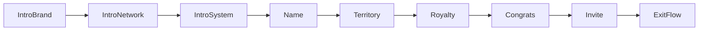

# Academy Onboarding — Spec Alignment + UI Consistency

## Defaults (unanswered product choices)

- **Home city + royalty:** UI-only for now. Hold in flow state; show on congrats / invite preview. No DB migration. “Change” city is a visible no-op (or Alert “Coming soon”). Academy create still only persists name via existing `become_academy_manager`.
- **Invite link:** On screen 8, generate a real AO-5 `academy_invites` row and share `academypro://invite/<token>` (working deep link). Display that URL in the invite block (spec’s `academypro.app/join/...` is marketing-only and not wired).

If you want persistence or the web URL instead, say so before implementation.

## Gap vs today

Current flow in [`src/screens/coach/AcademyOnboardingFlow.js`](src/screens/coach/AcademyOnboardingFlow.js): 4 steps; circular **dots**; Skip jumps to name; create fires on step 4.

Spec: **8 screens**; intro 1–3 unchanged in content; steps 4–6 use a **3-segment progress bar**; then congrats + invite.

## UI consistency rules (non-negotiable)

Extract shared chrome used by **screens 4–8** (and reused where it already matches intro CTAs without changing intro layout/copy):

| Token / component | Spec |
|---|---|
| Colors | `#FFFFFF` bg, `#007AFF` primary, `#6366F1` / `#0EA5E9` / `#22C55E` accents, `#F8F9FA` surfaces, `#E5E5E5` borders, `#000` / `#666` / `#999` text |
| ProgressBar | 3 segments, 3px tall, radius 2, gap 4 — **only** on screens 4–8 |
| BackRow | Lucide chevron 16 + “Back” 14/600/`#666` |
| PrimaryButton | Full width, `#007AFF`, white, 16/700, pad 15, radius **14**, no arrow |
| GhostButton | Transparent, `#999`, 14/600 |
| Footer | Absolute bottom, top border `#E5E5E5`, pad 14/24/34 |
| Icons | Lucide only, no emoji; tint chips 36×36 radius 10 |

**Do not touch** screens 1–3 structure/copy/animations (per “Do Not Touch”). Keep their existing skip/close chrome and feature cards. Only fix **Skip navigation**: Skip advances to the **next** screen (1→2, 2→3, 3→4), not jump-to-name.

Screen 4 stays the same layout; apply only the three listed fixes so it matches setup chrome used by 5–8.

## Implementation

### 1. Shared primitives inside the flow file (or small colocated helpers)

Refactor [`AcademyOnboardingFlow.js`](src/screens/coach/AcademyOnboardingFlow.js) to add:

- `ProgressBar({ completedCount })` — 1/2/3 filled for screens 4/5/6; all filled on 8
- `BackRow`, `PrimaryButton`, `GhostButton`, `Footer`, `StepTag`
- Flow state: `{ name, homeCity, royaltyRate }`  
  Defaults: `homeCity = { city: 'San Diego', region: 'CA', short: 'SD, CA' }`, `royaltyRate = 10`

### 2. Screen 4 — Name (fixes only)

- Heading: “Name your” / “academy.” — 36/800, letterSpacing -0.6
- Input: border `#E5E5E5` at rest, `#007AFF` on focus; radius 14
- Remove “Tap to edit” / noisy hint if present (keep subtle settings note if already there and on-spec)
- Progress bar: segment 1 on; CTA **Continue** → screen 5 (not create yet)
- Create RPC moves to screen 6 CTA (“Launch my academy”)

### 3. Screen 5 — Set Your Territory (NEW)

- Step tag `STEP 2 OF 3`, heading “Set your” / “home city.”
- Map card 220px: simplified US silhouette (RN `View`/`Svg` if `react-native-svg` already in app), home pulse dot + 3 open cities + dashed lines + legend
- Territory row: YOUR CITY / San Diego, CA / HOME badge / Change (future)
- CTA: “This is my territory”

### 4. Screen 6 — Set Your Royalty Rate (NEW)

- Step tag `STEP 3 OF 3`
- Three selectable rate cards (7 / **10 default + Recommended badge** / 15) with math lines
- CTA **Launch my academy** → call existing create path (today in ProfileScreen `onComplete`), then advance to screen 7  
  - Lift create into the flow **or** change `onComplete` to receive `{ name, homeCity, royaltyRate }` and have ProfileScreen RPC on that callback before/while showing congrats  
  - Preferred: flow calls `onComplete(payload)` once at Launch; parent creates academy; on success flow shows screen 7 (pass created slug/id back if needed for invite)

### 5. Screen 7 — Congrats (NEW)

- No progress / no back; confetti (simple RN Animated particles, 25, palette colors)
- Trophy hero + “YOUR ACADEMY IS LIVE” + Welcome + academy name
- Stats: royalty % | home short | `$0` royalties
- Primary: Invite my first coach → 8; Ghost: Skip for now → 8

### 6. Screen 8 — Invite (NEW)

- Progress all on; back → 7
- After academy exists: insert `academy_invites` (same pattern as AdminDashboard AO-5), show link + Copy / Message / Email / Share (`Share` / `Linking` / `Clipboard`)
- Preview card: academy name, keep-% = `100 - royaltyRate`, estimated take-home copy per spec
- Primary + Ghost both exit onboarding (`onDismiss` / success close)

### 7. Parent wiring

Update [`ProfileScreen.js`](src/screens/ProfileScreen.js) `AcademyOnboardingFlow` `onComplete` to accept the richer payload (name required; city/rate optional for display). Keep RPC args unchanged (`academy_name`, `academy_slug`, `academy_logo_url`). Generate invite from screen 8 inside the flow once `academyId` is available (return id from parent after RPC, or have flow invoke a new `onCreate` / `onGenerateInvite` callback).

Do **not** change AdminDashboard create-academy form or other admin screens (spec: Admin behavior unchanged).

## Out of scope

- DB columns for city/royalty; city search picker; web join URLs; redesign of intro screens 1–3; bundle ID / fonts.
