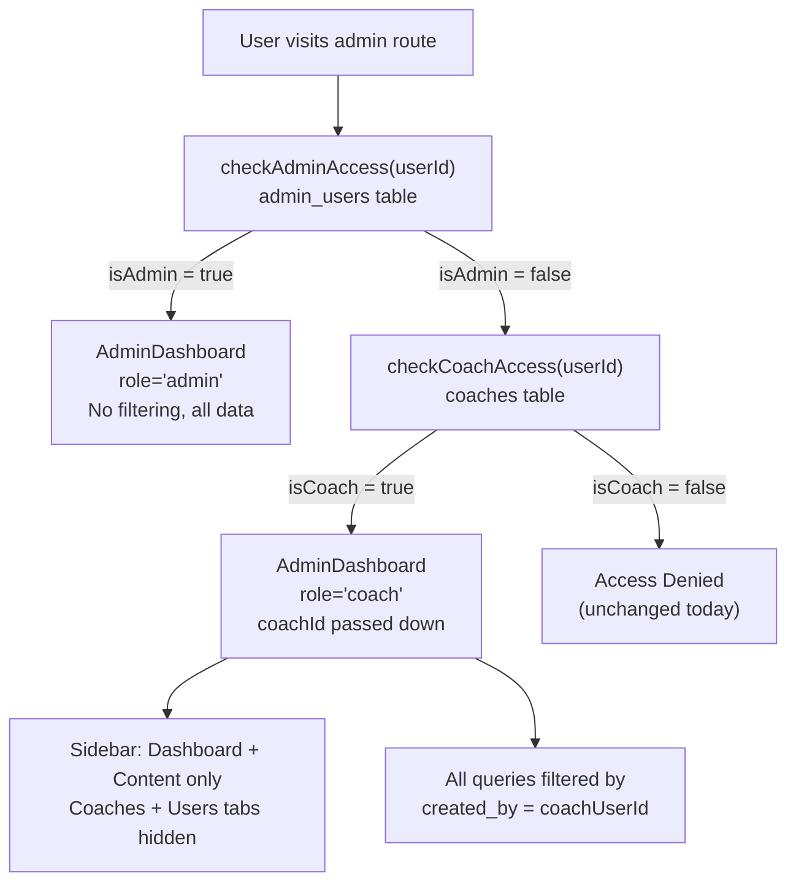

# Coach Web Dashboard Access Plan

## Architecture Overview



## Files to Change

### 1. [`src/components/AdminRoute.js`](src/components/AdminRoute.js)
**Current:** checks `admin_users` only, renders `<AdminDashboard adminRole={adminRole} />` on success or "Access Denied" on failure.

**Change:** add a fallback `checkCoachAccess` when `isAdmin = false`. Introduce a `sessionRole` state (`'admin'` | `'coach'` | `null`) and `coachId` state.

```javascript
// After isAdmin = false:
const { isCoach, coachId: id } = await checkCoachAccess(user.id);
if (isCoach) {
  setSessionRole('coach');
  setCoachId(id);           // coaches.id (the UUID from the coaches table)
}
```

Pass `sessionRole` and `coachId` to `AdminDashboard`:
```javascript
<AdminDashboard navigation={navigation} adminRole={adminRole} sessionRole={sessionRole} coachId={coachId} />
```

The "Access Denied" block now triggers only when `sessionRole` is still null after both checks.

Note: `checkCoachAccess` already exists in [`src/lib/supabase.js`](src/lib/supabase.js) and returns `{ isCoach, coachId }`.

---

### 2. [`src/screens/admindashboard/AdminSidebar.js`](src/screens/admindashboard/AdminSidebar.js)
**Current:** `NAV_ITEMS` is a hardcoded array of 7 items.

**Change:** accept a `sessionRole` prop and filter `NAV_ITEMS` before rendering:
```javascript
const visibleNavItems = sessionRole === 'coach'
  ? NAV_ITEMS.filter(item => ['dashboard', 'content'].includes(item.id))
  : NAV_ITEMS;
```
Also change the subtitle text from `"Admin Dashboard"` to `sessionRole === 'coach' ? "Coach Dashboard" : "Admin Dashboard"`.

---

### 3. [`src/screens/AdminDashboard.js`](src/screens/AdminDashboard.js)
Accept `sessionRole` and `coachId` as new props (default `'admin'` / `null`).

The `coachId` received here is `coaches.id`. The `programs.created_by` field stores the **user's UUID** (`users.id`), not `coaches.id`. So the filter must use `user.id` (the logged-in user's auth UUID), which is already available via `useAuth()`. No extra lookup needed.

#### a) `fetchStats()` — scope counts for coach
```javascript
// Admin: unchanged
// Coach:
const [programsRes, studentsRes] = await Promise.all([
  supabase.from('programs').select('id', { count: 'exact' }).eq('created_by', user.id),
  supabase.from('coach_students').select('id', { count: 'exact' }).eq('coach_id', coachId)
]);
setStats({ programs: programsRes.count, students: studentsRes.count });
```
Stat cards for "Total Users" and "Total Coaches" are hidden for coaches (render only "My Programs" and "My Students" tiles).

#### b) `fetchPrograms()` — scope for coach
Add one line after the query:
```javascript
let query = supabase.from('programs').select('*')...;
if (sessionRole === 'coach') query = query.eq('created_by', user.id);
```

#### c) `fetchRoutines()` — scope through parent programs
```javascript
// Coach only: join through programs to filter by created_by
if (sessionRole === 'coach') {
  // fetch program IDs owned by coach, then filter routines
  const { data: myPrograms } = await supabase
    .from('programs').select('id').eq('created_by', user.id);
  const programIds = (myPrograms || []).map(p => p.id);
  query = query.in('program_id', programIds);
}
```

#### d) `fetchExercises()` — scope through routines → programs
Same two-step approach: get owned program IDs → get routine IDs in those programs → filter exercises.

#### e) `fetchUsers()` — replace with student fetch for coach
```javascript
if (sessionRole === 'coach') {
  // Fetch only students linked via coach_students
  const { data } = await supabase
    .from('coach_students')
    .select('students:student_id(id, name, email, avatar_url, created_at, tier, dupr_rating, student_code, onboarding_completed)')
    .eq('coach_id', coachId)
    .eq('is_active', true);
  setUsers(data.map(row => row.students));
  return;
}
// Admin: unchanged
```

#### f) Tab routing — hide unreachable tabs for coach
In the `useEffect` that triggers fetches based on `activeTab`:
```javascript
if (sessionRole === 'coach' && ['coaches', 'feedback', 'analytics', 'settings'].includes(activeTab)) return;
```

#### g) `WebCreateProgramModal` — for coach, use `create_program_as_user` RPC
The existing `WebCreateProgramModal` always calls `create_program_as_admin`. For coaches, pass `sessionRole` to the modal so it uses `create_program_as_user` instead. This also sets `created_by = user.id` automatically through the RPC.

#### h) Sidebar prop — pass `sessionRole` down
```javascript
<AdminSidebar ... sessionRole={sessionRole} />
```

---

### 4. [`src/components/WebCreateProgramModal.js`](src/components/WebCreateProgramModal.js)
Accept a `sessionRole` prop. In `handleCreateProgram`:
```javascript
const rpcName = sessionRole === 'coach' ? 'create_program_as_user' : 'create_program_as_admin';
const result = await supabase.rpc(rpcName, { ... });
```
This ensures coach-created programs have `created_by = auth.uid()` and are not published by default.

---

### 5. Supabase RLS policies (SQL migration)
Run via Supabase SQL editor (no schema changes, additive policies only).

**programs table:**
```sql
create policy "coach_own_programs_select"
on programs for select using (
  created_by = auth.uid()
  or exists (select 1 from admin_users where user_id = auth.uid() and is_active = true)
);

create policy "coach_own_programs_insert"
on programs for insert with check (
  created_by = auth.uid()
  or exists (select 1 from admin_users where user_id = auth.uid() and is_active = true)
);

create policy "coach_own_programs_update"
on programs for update using (
  created_by = auth.uid()
  or exists (select 1 from admin_users where user_id = auth.uid() and is_active = true)
);
```

**routines + exercises (scope through parent program):**
```sql
create policy "coach_own_routines_select"
on routines for select using (
  exists (select 1 from programs p where p.id = routines.program_id
    and (p.created_by = auth.uid()
         or exists (select 1 from admin_users where user_id = auth.uid() and is_active = true)))
);

create policy "coach_own_exercises_select"
on exercises for select using (
  exists (
    select 1 from routine_exercises re
    join routines r on r.id = re.routine_id
    join programs p on p.id = r.program_id
    where re.exercise_id = exercises.id
    and (p.created_by = auth.uid()
         or exists (select 1 from admin_users where user_id = auth.uid() and is_active = true))
  )
);
```

**users (coach sees only their students):**
```sql
create policy "coach_students_select"
on users for select using (
  id = auth.uid()
  or exists (select 1 from admin_users where user_id = auth.uid() and is_active = true)
  or exists (
    select 1 from coach_students cs
    join coaches c on c.id = cs.coach_id
    where cs.student_id = users.id
    and c.user_id = auth.uid()
    and cs.is_active = true
  )
);
```

> **Important:** before enabling these policies, check whether `programs`, `routines`, `exercises`, and `users` already have RLS enabled (`alter table programs enable row level security`). If existing policies are permissive (`for select using (true)`), the new restrictive policies will conflict — existing overly-broad policies must be reviewed or made additive.

---

## Verification Checklist
- Admin login: all 7 sidebar tabs present, all global counts unchanged
- Coach login: sidebar shows only Dashboard + Content Management; no Coaches, Users tabs
- Coach Content tab: only shows programs where `created_by = coach.user_id`
- Coach creates a program: saved via `create_program_as_user`, appears immediately in their list
- Coach Dashboard stats: shows count of their programs and linked students
- Coach with 0 programs: empty state displayed (no error)
- Direct Supabase query by a coach for another coach's program ID: blocked by RLS
