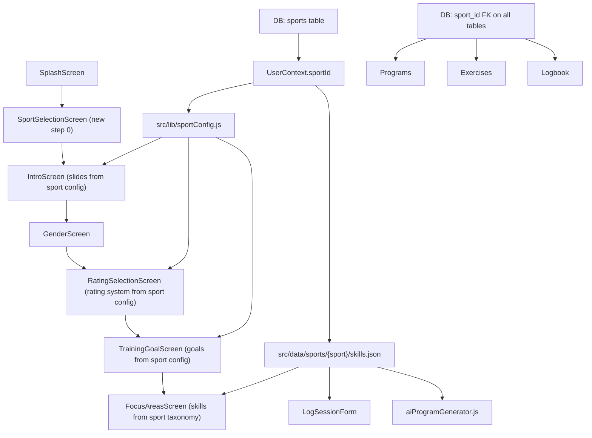

# Multi-Sport Architecture + AcademyPro Rename

## Recommended Execution Order (sequencing risk)

Phase 1 (rename) and Phases 2-5 (architecture) have zero mutual dependency — they can and should be shipped separately:

- **Ship Phases 2-3 first** — DB `sport_id` scaffolding + sport config layer. Migrations are nullable and backward compatible; no user-visible change. Zero store review risk.
- **Ship Phases 4-5 next** — Sport selection screen + all downstream wiring. Can be on the same release as Phases 2-3.
- **Ship Phase 1 any time independently** — Since the bundle ID is unchanged, the rename is now purely a display name, copy, deep-link-scheme, and storage-key change. No OAuth clients, no new EAS project, no push credential reset. Low risk; can ship before or after the architecture phases.

## Architecture Overview



## Phase 1 — Rename to AcademyPro

Bundle ID (`com.picklepro.mobile`) is **unchanged** — no store relisting, no OAuth client changes, no EAS project reset.

What changes:
- [`app.json`](app.json): `name` → `AcademyPro`, `slug` → `academypro-mobile` (see EAS note below), `scheme` → `academypro`
- [`package.json`](package.json): `name` → `academypro-mobile`
- [`src/lib/deepLinkHandler.js`](src/lib/deepLinkHandler.js) + [`src/lib/authRedirect.js`](src/lib/authRedirect.js) + [`src/screens/fungame/DoublesSetupScreen.js`](src/screens/fungame/DoublesSetupScreen.js): `pickleballhero://` → `academypro://`

What does NOT change:
- `bundleIdentifier` / `applicationId` / `namespace` — stays `com.picklepro.mobile`
- Google Sign-In `iosUrlScheme`, OAuth clients, `google-services.json` — no changes needed
- Apple Sign-In App ID — no changes needed
- Associated domain — stays `pickleballhero.app` unless you also acquire `academypro.app`

### EAS slug note

Changing `slug` from `picklepro-mobile` to `academypro-mobile` creates a new EAS project on expo.dev. Unlike a bundle-ID change, this does **not** reset push credentials (APNs/FCM are bound to the bundle ID, not the slug), but it does mean:
- A new `eas project:create` is needed and `extra.eas.projectId` must be updated.
- Build history (but not credentials) starts fresh on the new project.
- **Alternative**: keep `slug: "picklepro-mobile"` and only change `name` — EAS project stays the same, only the display name changes. Recommended if you want zero EAS disruption.

AsyncStorage key migration — dual-read strategy with explicit cleanup window:

| Old key | New key |
|---|---|
| `@picklepro_onboarding_state` | `@academypro_onboarding_state` |
| `@picklepro_onboarding_finish_state` | `@academypro_onboarding_finish_state` |
| `@pickleHero_programTabLastSeen` | `@academypro_programTabLastSeen` |
| `@pickleHero_lastOpenedProgram` | `@academypro_lastOpenedProgram` |
| `@pickleball_hero:app_version` | `@academypro:app_version` |
| `@pickleball_hero:session_backup` | `@academypro:session_backup` |
| `@pickleHero_progress_*` | `@academypro_progress_*` |
| `@pickleHero_myTrainingWelcomed` | `@academypro_myTrainingWelcomed` |

Migration behaviour:
- **On first open after upgrade**: read old key → write new key → leave old key in place.
- **Cleanup release (N+2 build, minimum 4 weeks after migration release)**: `AsyncStorage.multiRemove(OLD_KEYS)` on startup. Only delete once analytics confirm < 1% of active users are still on the pre-migration build.
- **Holdout users (never upgrade)**: their old build continues reading old keys — no data loss. When they eventually upgrade, migration runs on first open as normal.
- **App Store review delay edge case**: migration code is in place before the new binary is live; existing users are unaffected until they receive the update.

User-facing copy sweep (no structure change, just string replacement):
- [`src/screens/SplashScreen.js`](src/screens/SplashScreen.js), [`src/screens/SignUpScreen.js`](src/screens/SignUpScreen.js), [`src/screens/CreateAccountScreen.js`](src/screens/CreateAccountScreen.js), [`src/screens/HelpSupportScreen.js`](src/screens/HelpSupportScreen.js), [`src/screens/ProgramLoadingScreen.js`](src/screens/ProgramLoadingScreen.js), [`src/screens/admindashboard/AdminSidebar.js`](src/screens/admindashboard/AdminSidebar.js), [`src/screens/CreateCoachProfileScreen.js`](src/screens/CreateCoachProfileScreen.js), [`src/screens/CoachScreen.js`](src/screens/CoachScreen.js), [`src/screens/AdminDashboard.js`](src/screens/AdminDashboard.js), [`src/screens/FeedbackScreen.js`](src/screens/FeedbackScreen.js), [`src/screens/ProgramDetailScreen.js`](src/screens/ProgramDetailScreen.js) (share message/title: "pickleball training program"), `Website/`

## Phase 2 — DB: Sport Architecture Foundation

### New `sports` table

```sql
CREATE TABLE public.sports (
  id          uuid PRIMARY KEY DEFAULT gen_random_uuid(),
  slug        text NOT NULL UNIQUE,       -- 'pickleball', 'tennis', ...
  name        text NOT NULL,              -- 'Pickleball'
  rating_system jsonb NOT NULL DEFAULT '{}',
  -- e.g. {"type":"dupr","min":2.0,"max":8.0,"tiers":[{"label":"Beginner","min":2.0,"max":2.5},...]}
  is_active   boolean NOT NULL DEFAULT true,
  created_at  timestamptz DEFAULT now()
);
INSERT INTO sports (slug, name, rating_system) VALUES (
  'pickleball', 'Pickleball',
  '{"type":"dupr","min":2.0,"max":8.0,"label":"DUPR","tiers":[...]}'
);
```

### Add `sport_id` FK (nullable — no breaking change for existing rows)

Tables to migrate: `users`, `programs`, `exercises`, `coaches`, `assessment_templates`, `logbook_entries`

```sql
-- Pattern repeated for each table
ALTER TABLE public.users
  ADD COLUMN sport_id uuid REFERENCES public.sports(id);

-- Backfill existing rows to pickleball
UPDATE public.users SET sport_id = (SELECT id FROM sports WHERE slug = 'pickleball');
```

### Generalize rating fields on `users` and `coaches`

Keep `dupr_rating` / `dupr_id` as-is for pickleball backward compatibility. Add two new nullable columns:

```sql
ALTER TABLE public.users
  ADD COLUMN skill_rating  numeric,    -- sport-agnostic level
  ADD COLUMN rating_system text;       -- 'dupr' | 'utr' | 'ittf' | 'self'
-- Backfill from existing dupr_rating
UPDATE public.users SET skill_rating = dupr_rating, rating_system = rating_type
  WHERE dupr_rating IS NOT NULL;
```

For `exercises`, rename the conceptual meaning of `dupr_range_min/max` to generic `level_range_min/max` via comment; add view alias (no column rename yet — preserve existing queries).

### `assessment_templates` already has `academy_id` — add `sport_id`

Handled by the pattern above.

### Close existing RLS gap in the same migration (GAP-14)

The `programs_update_academy_manager_publish` RLS policy on the `programs` table currently has `WITH CHECK = null` (no insert-time restriction), which is a security hole allowing academy managers to write arbitrary rows. Since this migration already touches `programs` (adding `sport_id`), close the gap in the same SQL file rather than layering a separate migration on top:

```sql
-- Fix: replace the null WITH CHECK with a proper restriction
DROP POLICY IF EXISTS programs_update_academy_manager_publish ON public.programs;
CREATE POLICY programs_update_academy_manager_publish ON public.programs
  FOR UPDATE
  USING (
    academy_id IN (
      SELECT academy_id FROM academy_members
      WHERE user_id = auth.uid() AND role IN ('manager','coach')
    )
  )
  WITH CHECK (
    academy_id IN (
      SELECT academy_id FROM academy_members
      WHERE user_id = auth.uid() AND role IN ('manager','coach')
    )
  );
```

Validate against existing RLS test queries before applying to production.

## Phase 3 — Sport Config Layer (code)

### `src/lib/sportConfig.js` (new file)

Central registry that drives all sport-specific variations. Structure:

```js
export const SPORTS = {
  pickleball: {
    id: 'pickleball',
    name: 'Pickleball',
    ratingSystem: { type: 'dupr', label: 'DUPR', min: 2.0, max: 8.0 },
    skillsFile: () => require('../data/sports/pickleball/skills.json'),
    onboardingGoals: [
      { id: 'dupr', title: 'Improve my DUPR rating', ... },
      ...
    ],
    introSlides: [ ... ],     // replaces SLIDES array in IntroScreen
    assessmentConfig: { firstQuestion: 'playedSport', ... },
    funGameEnabled: true,
  },
  // tennis: { ... }  ← future
};

export function getSport(sportId) { return SPORTS[sportId] ?? SPORTS.pickleball; }
```

### `src/data/sports/pickleball/skills.json` (new file)

Direct copy of current [`src/data/Commun_skills_tags.json`](src/data/Commun_skills_tags.json). The original file is kept temporarily as a re-export shim so existing imports don't break during migration.

### `src/lib/skillTaxonomy.js` — sport-aware

Add a `getSportSkills(sportId)` entry point that loads the right file. All current `getAllSkills()` / `buildSkillChipOptions()` calls remain valid and automatically route to pickleball.

### `src/lib/skillIcons.js` — sport-aware

`getSkillIconComponent(skillId, sportId)` — today returns pickleball map; future sports add their own maps.

## Phase 4 — Sport Selection Onboarding Screen

### `src/screens/SportSelectionScreen.js` (new file)

- New step **SPORT = 0** inserted before current `IntroScreen` in [`src/lib/onboardingSteps.js`](src/lib/onboardingSteps.js)
- Renders a sport card grid — one card for now (Pickleball), others "Coming Soon"
- On select: calls `updateOnboardingData({ sportId: 'pickleball' })` → persisted to UserContext
- No back button (it's the entry point)
- Styled with `OnboardingShell`

### [`src/navigation/OnboardingNavigator.js`](src/navigation/OnboardingNavigator.js)

Insert `SportSelection` as the first screen in the stack (before `Intro`).

### `src/context/UserContext.js`

Add `sportId` to `DEFAULT_USER`. Persist to Supabase `users.sport_id`. Include key migration logic (dual-read old `@picklepro_*` keys on first hydration).

## Phase 5 — Wire Sport Through Downstream Consumers

### Onboarding screens already touched by sport

| Screen | What changes |
|---|---|
| [`IntroScreen.js`](src/screens/IntroScreen.js) | Load `SLIDES` from `getSport(sportId).introSlides` |
| [`RatingSelectionScreen.js`](src/screens/RatingSelectionScreen.js) | Rating label + range from sport config; "I'm new to pickleball" → dynamic |
| [`TrainingGoalScreen.js`](src/screens/TrainingGoalScreen.js) | Goal options from `getSport(sportId).onboardingGoals`; title becomes generic |
| [`FocusAreasScreen.js`](src/screens/FocusAreasScreen.js) | Skill list from `getSportSkills(sportId)` |
| [`ProgramLoadingScreen.js`](src/screens/ProgramLoadingScreen.js) | Body copy → generic |

### Logbook

[`src/components/logbook/LogSessionForm.js`](src/components/logbook/LogSessionForm.js): replace hardcoded `QUICK_SKILL_IDS` and `SKILL_GROUPS` constants with a function that reads them from `getSportSkills(sportId)` via `useUser().user.sportId`.

### AI Program Generator

[`src/lib/aiProgramGenerator.js`](src/lib/aiProgramGenerator.js): `getDifficultyTier()` and `getDifficultyFromDUPR()` become `getDifficultyTier(rating, sport)` — reads cutoffs from `getSport(sport).ratingSystem.tiers`.

### Assessments

[`src/lib/assessmentTemplatesApi.js`](src/lib/assessmentTemplatesApi.js): `DEFAULT_EXPERIENCE_TEMPLATE` first question `playedPickleball` → `playedSport` with sport-injected label. Coach screens that fall back to `'playedPickleball'` id → `questions[0].id` (already the fallback pattern, remove the string literal).

### Profile — Edit Rating section

[`src/screens/ProfileScreen.js`](src/screens/ProfileScreen.js) has a full interactive "Edit DUPR Rating" modal (`showDuprModal` state, `saveDuprRating()`, direct `users.dupr_rating` DB write). This is a functional change, not just copy:
- Label "DUPR RATING" → `getSport(sportId).ratingSystem.label`
- Validation format/range pulled from sport config instead of hard-coded `x.xxx` / 1–8 bounds
- DB write continues to hit `dupr_rating` for pickleball (and `skill_rating` for future sports via the generalized columns added in Phase 2)

### Local exercise banks (offline fallback)

Two files contain large hardcoded pickleball drill banks used as local fallbacks when the DB has no matching exercises. Both are pickleball-locked and need to be scoped:

- [`src/lib/programGenerator.js`](src/lib/programGenerator.js): `exerciseBank` constant (~150 lines, dinks/drives/serves/volleys/drops/etc.) + `generatePersonalizedProgram()` with hardcoded default focus areas `['dinks', 'serves', 'returns', 'volleys']` and DUPR-derived difficulty. Rename to `programGenerator.pickleball.js` and import conditionally through sport config, or (simpler) annotate it as pickleball-only and gate its call behind `sportId === 'pickleball'`.
- [`src/screens/ProgramScreen.js`](src/screens/ProgramScreen.js): `staticExercises` object (~35 lines, same sport-specific drills) used in the "Customized" tab. Same treatment — gate or sport-scope.

### Admin UI — rating field labels

These fields have functional inputs (not just labels) that validate against DUPR format/range. They need to read label and validation bounds from sport config when a sport context is available. Affected files:
- [`src/components/AddUserModal.js`](src/components/AddUserModal.js) — "DUPR Rating (Optional)" input
- [`src/components/AddCoachModal.js`](src/components/AddCoachModal.js) — "DUPR Rating" input
- [`src/screens/CreateCoachProfileScreen.js`](src/screens/CreateCoachProfileScreen.js) — DUPR Rating form field
- [`src/screens/AdminDashboard.js`](src/screens/AdminDashboard.js) — "DUPR Rating" column header + "DUPR Users" stat card title

### Admin exercise create/edit — Level Range fields

[`src/components/WebCreateExerciseModal.js`](src/components/WebCreateExerciseModal.js) has dedicated `duprRangeMin` / `duprRangeMax` state with DUPR-value dropdown pickers. [`src/screens/admindashboard/components/ExercisesTable.js`](src/screens/admindashboard/components/ExercisesTable.js) and [`src/components/EditableProgramStructureModal.js`](src/components/EditableProgramStructureModal.js) display the resulting badge. Rename UI labels to "Level Range" (generic) and keep writing to the existing `dupr_range_min/max` DB columns (per Phase 2 — no column rename, just label change).

### 6-Point Doubles Game

[`src/screens/fungame/DoublesSetupScreen.js`](src/screens/fungame/DoublesSetupScreen.js): wrap game entry in a pickleball-sport check (`user.sportId === 'pickleball'`). Show "coming soon for your sport" otherwise.

## Files created / key files changed

**New files:**
- `src/screens/SportSelectionScreen.js`
- `src/lib/sportConfig.js`
- `src/data/sports/pickleball/skills.json`

**Modified (identity / rename):**
- `app.json` — `name`, `slug` (optional), `scheme`
- `package.json` — `name`

**Modified (architecture):**
- `src/lib/onboardingSteps.js` — add SPORT step
- `src/context/UserContext.js` — sportId state + key migration
- `src/lib/skillTaxonomy.js` — sport-aware entry points
- `src/lib/skillIcons.js` — sport-aware
- `src/navigation/OnboardingNavigator.js` — insert sport screen
- `src/lib/deepLinkHandler.js`, `src/lib/authRedirect.js` — new scheme
- `src/lib/aiProgramGenerator.js` — sport-aware tiers
- `src/lib/assessmentTemplatesApi.js` — generalize question IDs
- `src/components/logbook/LogSessionForm.js` — sport-aware skill groups
- `src/screens/ProfileScreen.js` — sport-config-driven rating edit modal
- `src/lib/programGenerator.js` — gate / sport-scope pickleball exercise bank
- `src/screens/ProgramScreen.js` — gate / sport-scope staticExercises fallback
- `src/components/WebCreateExerciseModal.js` — rename DUPR range UI labels to "Level Range"
- `src/components/AddUserModal.js`, `src/components/AddCoachModal.js`, `src/screens/CreateCoachProfileScreen.js` — sport-aware rating field labels/validation
- ~14 screens for copy / "PicklePro" / "pickleball" / "DUPR" strings

**DB migration (1 file, applied once):**
- `supabase/migrations/YYYYMMDD_multi_sport.sql` — sports table + sport_id columns + backfill

## What stays pickleball-only (no change needed yet)

- The 281 exercises in the database — tagged pickleball by default via backfill
- Free programs JSON files
- Website marketing copy (separate task)
- 6-point game logic (gated, not removed)
