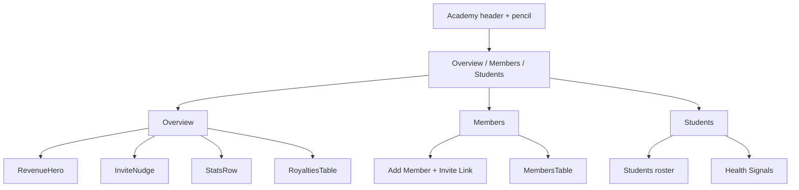

# My Academy Dashboard Redesign

## Decisions (locked)

- **Tabs:** Overview (default) · Members · Students
- **Settings:** No Settings tab — keep the existing pencil + edit modal on the academy header
- **Finance:** All revenue/royalty dollar figures are **UI placeholders** (`$0` / empty-state graceful). No DB schema changes. Derive coach/student counts from existing `academy_members` / `academy_students` queries
- **Header meta (HARD RULE):** Format is **exactly** `@slug · X% royalty`. No city. The HTML mockup’s `San Diego, CA` is sample data only — **never hardcode** a city string.
- **Projection box (HARD RULE):** When `coachCount === 0`, hide the projection fill/track math entirely and set the note to `"Invite your first coach to start earning royalties."` Only compute target / fill / “Add X more coaches…” when `coachCount >= 1` (then `avgRoyaltyPerCoach` may use default **415** if royalties are still `$0`).
- **Out of scope:** Sidebar, other admin screens, Members RPC/logic, RLS

## Target UX

Visual reference: `[academy_owner_dashboard.html](/Users/guillaumepanot/Downloads/academy_owner_dashboard.html)` + Word spec tokens. Platform: React Native Web admin dashboard.

## Files to change

- `[src/screens/AdminDashboard.js](src/screens/AdminDashboard.js)` — rewrite `renderAcademyTab` only (create-academy empty state stays)
- `[src/screens/admindashboard/adminDashboardStyles.js](src/screens/admindashboard/adminDashboardStyles.js)` — new Overview / tab / topbar action styles
- `[src/screens/admindashboard/components/AdminTopBar.js](src/screens/admindashboard/components/AdminTopBar.js)` — title + actions for `academy` tab

Do **not** modify `[AdminSidebar.js](src/screens/admindashboard/AdminSidebar.js)` or other tabs.

## 1. Top bar

In `AdminTopBar`:

- `getPageTitle('academy')` → `"My Academy"`
- When `activeTab === 'academy'` and academy exists, show:
  - **Manage Members** (outline) → callback switches inner tab to `members`
  - **Invite a Coach** (primary `#007AFF`) → switches to `members` and focuses invite section (ref/`scrollIntoView` on web)

Pass callbacks from `AdminDashboard` (e.g. `onAcademyManageMembers`, `onAcademyInviteCoach`). Hide actions when `!academyId`.

## 2. Page chrome (always visible when academy exists)

Replace the current KPI strip + stacked layout with:

1. **Academy header** (above tabs): logo 48×48 (photo or `#007AFF` + Lucide `Home`), name 22/900, meta **`@{slug} · {royalty}% royalty` only**
   - Do **not** append city (no `home_city` in DB; mockup city is not real data)
   - Pencil opens existing `showMyAcademyEditModal` (unchanged save path: name, logo, royalty)
2. **Inner tabs** underline style (`#007AFF` active): Overview | Members | Students
3. State: `myAcademySubTab` default `'overview'`

## 3. Overview tab (new)

Match HTML structure and design tokens (`#000` hero, `#F8F9FA` surface, `#007AFF` / `#6366F1` / `#22C55E`, Lucide icons).

| Block                  | Behavior with real data today                                                                                                                                                                                                                                                                                                                     |
| ---------------------- | ------------------------------------------------------------------------------------------------------------------------------------------------------------------------------------------------------------------------------------------------------------------------------------------------------------------------------------------------- |
| **Revenue hero**       | Amount `$0`; sub “from N affiliated coaches · Month Year”; hide MoM delta when prior = 0 / unavailable; breakdown: active coaches, total students, royalty %, Network Revenue `$0`. **Projection box:** if `coachCount === 0` → no fill bar / no “Add X coaches” math; note = `"Invite your first coach to start earning royalties."` If `coachCount >= 1` → next round target, fill %, and “Add X more coaches…” using `avgRoyaltyPerCoach` (default **415** only when royalties are still `$0`) |
| **Invite nudge**       | Show when affiliated coach count **< 5**; CTA → Members + invite focus                                                                                                                                                                                                                                                                            |
| **Stats row**          | Direct revenue `$0`; affiliated coaches = coach-role members; students = `academyStudents.length`; deltas from `joined_at` / student `created_at` this month when computable                                                                                                                                                                      |
| **Royalties by coach** | One row per affiliated coach (role=`coach`, exclude self-as-owner if they are manager-only — include coaches only). Students from existing roster grouped by coach; Gross/Royalty `**$0`**; Status Active vs “Joined [date]” if joined this month. Empty state + invite CTA when no coaches                                                       |

Financial fields stay zeroed; only counts are live.

## 4. Members tab (move, logic unchanged)

Move existing Add Member, Invite via Link, and Members table **without changing RPCs / role options (Coach / Staff / Manager) / remove / change-role**.

Layout polish to match HTML (web): 2-column grid for Add + Invite; members table below. Keep mobile stacked layout. Preserve error/success feedback and invite copy.

Attach a `ref` on the Invite card for top-bar “Invite a Coach” scroll/focus.

## 5. Students tab (new home for existing sections)

Move **Students roster** and **Health Signals** (inactive coaches + 8-week growth chart) here as-is — same queries/`academyStudents`/`inactiveCoaches`/`engagementTrend`. No new features.

## 6. Styles

Add styles in `[adminDashboardStyles.js](src/screens/admindashboard/adminDashboardStyles.js)` for: sub-tabs, revenue hero, projection box, invite nudge, overview stat cards, royalties table, Members 2-col grid. Prefer Lucide for Overview icons; Ionicons may remain in moved Members/Students blocks to avoid churn (“logic unchanged”).

## 7. Explicit non-goals

- No Settings tab / no slug editor / no home-city persistence
- No new migrations or columns
- No sidebar / Dashboard / Content / Offerings / Assessments changes
- No real payment aggregation (enrollments stay unused for Overview dollars)

