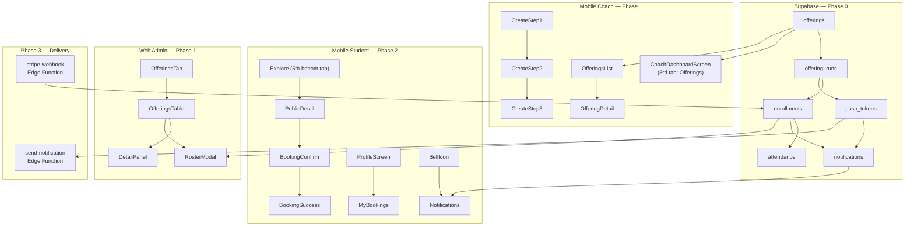

# Offerings Feature — Phased Implementation Plan

## Locked Decisions (from prior session)

- Payment link: **run-level** (`payment_link_url` on `offering_runs`)
- Waitlist `payment_status`: **`not_required`** until promoted to confirmed
- Explore tab: **dedicated 5th bottom tab**
- Currency: **per-academy** — `coaches` table already has a `currency` column (VND/USD); the `create_offering` RPC will inherit it from the creating coach

---

## Current Codebase State

### Existing tables that matter
- `coaches` — already has `currency` column (set during [`CreateCoachProfileScreen.js`](src/screens/CreateCoachProfileScreen.js) → `coaches.insert`). No `default_currency` column needed; reuse `currency`.
- `device_push_tokens` — exists from [`20260718000002`](supabase/migrations/20260718000002_device_push_tokens.sql) with schema `(id, user_id, token, platform, updated_at)`. The spec's new `push_tokens` table has a richer schema (`device_id`, `is_active`). Both will coexist; Phase 2 migrates `App.js` to use the new table.

### Existing Edge Functions
- `notify-on-publish/index.ts`, `notify-on-student-added/index.ts`, `reset-user-password/index.ts` — reads from `device_push_tokens`. Must not be touched.

### Navigation anchor points
- [`CoachNavigator.js`](src/navigation/CoachNavigator.js) — stack navigator; add 5 offering screens in Phase 1
- [`MainTabNavigator.js`](src/navigation/MainTabNavigator.js) — 4 tabs today; add Explore (5th) in Phase 2
- [`CoachDashboardScreen.js`](src/screens/coach/CoachDashboardScreen.js) — tab array at line 499 renders `[students, programs]`; add `offerings` in Phase 1

### Admin dashboard anchor points
- [`AdminSidebar.js`](src/screens/admindashboard/AdminSidebar.js) — `ALL_NAV_ITEMS` array at line 15; add `offerings` entry
- [`AdminDashboard.js`](src/screens/AdminDashboard.js) — `renderContent()` switch at line 4012; `COACH_ALLOWED_TABS` at line 278; add `offerings` case in Phase 1

---

## Architecture Overview



---

## Phase 0 — Backend Only

**Goal:** All 6 tables, RLS, 14 RPCs, 2 Edge Function stubs. Zero app code.

### Single migration file
**New file:** `supabase/migrations/20260720000000_offerings_v1.sql`

#### 0a — Tables (in FK order)
1. `offerings` — `(id, academy_id→coaches.id, program_id→programs.id, coach_id→coaches.id, title, type, description, location, facility_name, capacity_per_run, skill_level_min, skill_level_max, thumbnail_url, is_public DEFAULT false, status DEFAULT 'draft', created_at, updated_at)`
2. `offering_runs` — `(id, offering_id→offerings.id, start_date, end_date, session_schedule, sessions_json DEFAULT '[]', capacity, spots_filled DEFAULT 0 NOT NULL, price_amount DEFAULT 0 NOT NULL, price_currency DEFAULT 'USD', payment_link_url, status DEFAULT 'open', created_at, updated_at)`
3. `enrollments` — `(id, offering_run_id→offering_runs.id, student_id→users.id, status, waitlist_position, payment_status, payment_type, payment_amount_paid, payment_session_url, payment_reference, payment_notes, payment_paid_at, enrolled_at DEFAULT now(), updated_at)`
4. `push_tokens` — `(id, user_id→users.id, token, platform CHECK('ios','android'), device_id, is_active DEFAULT true, created_at, updated_at)` — coexists with `device_push_tokens`
5. `notifications` — `(id, user_id→users.id, type, title, body, data_json DEFAULT '{}', channel, push_status DEFAULT 'pending', expo_ticket_id, read_at, created_at)`
6. `attendance` — `(id, enrollment_id→enrollments.id, offering_run_id→offering_runs.id, session_date, routine_id→routines.id, status DEFAULT 'absent', checked_in_at, checked_in_by→users.id, notes, created_at)`

All indexes from spec §4 are included in the same file.

**Key constraint difference from spec:** `book_offering_run` sets `payment_status = 'not_required'` for waitlisted enrollments (not `'pending'` as spec default says).

#### 0b — RLS (all 6 tables)
Policies exactly as spec §5. No deviations.

#### 0c — RPCs (14 total, in dependency order)
SQL functions via `CREATE OR REPLACE FUNCTION`:
1. `create_offering(p_program_id, p_title, p_type, p_location, p_facility_name, p_capacity_per_run, p_skill_level_min, p_skill_level_max, p_description, p_thumbnail_url)`
2. `create_offering_run(p_offering_id, p_start_date, p_end_date, p_session_schedule, p_sessions_json, p_capacity, p_price_amount, p_price_currency, p_payment_link_url)`
3. `get_offering_with_runs(p_offering_id)` — returns offering + runs + per-run counts
4. `book_offering_run(p_offering_run_id)` — full transaction with `SELECT FOR UPDATE`; waitlist inserts get `payment_status = 'not_required'`
5. `cancel_enrollment(p_enrollment_id)` — waitlist promotion chain
6. `record_payment(p_enrollment_id, p_payment_type, p_payment_amount_paid, p_payment_reference, p_payment_notes)`
7. `get_run_roster(p_offering_run_id)`
8. `update_offering(p_offering_id, ...)` 
9. `update_offering_run(p_offering_run_id, ...)`
10. `close_offering_run(p_offering_run_id)`
11. `delete_offering(p_offering_id)` — soft delete, cascade-close runs
12. `send_payment_reminder(p_enrollment_id)` — excludes waitlisted; inserts notification row + calls `pg_net`
13. `upsert_push_token(p_token, p_platform, p_device_id)` — upserts into `push_tokens` (new table)
14. `mark_notifications_read(p_notification_ids uuid[])` — sets `read_at = now()` on caller's own rows

#### 0d — Edge Function stubs
- **New:** `supabase/functions/stripe-webhook/index.ts` — logs payload, returns 200
- **New:** `supabase/functions/send-notification/index.ts` — logs payload, returns 200

#### 0e — Phase 0 Self-Review (mandatory gate before Phase 1)

Run the following and fix every failure before proceeding:

```bash
npx jest   # all existing tests must still pass — no regressions
```

Then in Supabase Studio, run the 12 validation scenarios from spec §14:

| Scenario | Expected |
|---|---|
| Book a run with available spots | enrollment confirmed, spots_filled +1, notification inserted |
| Book the last available spot | enrollment confirmed, run status = `full` |
| Book a full run | enrollment waitlisted, waitlist_position assigned, payment_status = `not_required` |
| Cancel a confirmed enrollment | spots_filled -1, run reopens, first waitlisted promoted, notification inserted |
| Cancel when no waitlist | spots_filled -1, run reopens, no promotion attempt |
| Book a free run (price_amount = 0) | payment_status = `not_required` |
| Book a paid run (price_amount > 0) | payment_status = `pending` |
| Record cash payment as coach | payment columns updated, student cannot call the same RPC |
| Attempt to book as coach role | RLS blocks enrollment insert |
| Student reads another student's enrollment | RLS blocks select |
| Coach reads a run not in their academy | RLS blocks select |
| Direct write to spots_filled | blocked — no policy grants this |

Also verify: Edge Function stubs respond 200 when invoked via `supabase functions invoke`.

**Phase 1 does not start until all 12 pass and `npx jest` is green.**

---

## Phase 1 — Coach-Side UI (Mobile + Web Admin)

**Prerequisite:** All 12 Phase 0 validation scenarios pass.

### Mobile — new files
- `src/screens/coach/offerings/OfferingsListScreen.js`
- `src/screens/coach/offerings/CreateOfferingStep1Screen.js`
- `src/screens/coach/offerings/CreateOfferingStep2Screen.js`
- `src/screens/coach/offerings/CreateOfferingStep3Screen.js`
- `src/screens/coach/offerings/OfferingDetailScreen.js`
- `src/lib/offeringsApi.js` — thin wrappers for all offering RPCs

### Mobile — existing files touched
- [`src/navigation/CoachNavigator.js`](src/navigation/CoachNavigator.js) — add 5 `Stack.Screen` entries
- [`src/screens/coach/CoachDashboardScreen.js`](src/screens/coach/CoachDashboardScreen.js) — extend the tab array at line 499 from `[students, programs]` to `[students, programs, offerings]`; add `offerings` branch to `onRefresh` at line 440; add load trigger in the `useEffect` at line 78

### Web Admin — new files
- `src/screens/admindashboard/components/OfferingsTable.js`
- `src/screens/admindashboard/components/OfferingDetailPanel.js`
- `src/screens/admindashboard/components/CreateOfferingModal.js`
- `src/screens/admindashboard/components/EditOfferingModal.js`
- `src/screens/admindashboard/components/OfferingRosterModal.js`

### Web Admin — existing files touched
- [`src/screens/admindashboard/AdminSidebar.js`](src/screens/admindashboard/AdminSidebar.js) — add `{ id: 'offerings', label: 'Offerings', icon: 'storefront-outline' }` to `ALL_NAV_ITEMS`; add `'offerings'` to `COACH_NAV_IDS` and `MANAGER_NAV_IDS`
- [`src/screens/AdminDashboard.js`](src/screens/AdminDashboard.js) — add `'offerings'` to `COACH_ALLOWED_TABS` and `MANAGER_ALLOWED_TABS` at line 278; add `case 'offerings':` to `renderContent()` switch at line 4012; import the 5 new components

**DO NOT TOUCH:** `MainTabNavigator.js`, `ProgramScreen`, existing coach screens (Students/Programs/Assessment tabs), admin tabs Dashboard/Content/Coaches/Users/Academies.

### Phase 1 Self-Review (mandatory gate before Phase 2)

```bash
npx jest   # must stay green
```

**Known regressions to check manually:**

- `CoachDashboardScreen` — confirm the existing Students and Programs tabs still render correctly after adding the Offerings tab. Check that `onRefresh` handles the `offerings` branch without crashing when `coachId` is null on first mount.
- `CoachNavigator` — open a non-offering screen (e.g. `PlayerProfile`) and verify back navigation is unbroken. The new `Stack.Screen` entries must not shift the initial route.
- `AdminSidebar` — verify `COACH_NAV_IDS` and `MANAGER_NAV_IDS` now include `'offerings'` and that coaches do not see superadmin-only tabs (users, coaches management, academies).
- `AdminDashboard` — switch to the Offerings tab as a coach session, as a manager session, and as superadmin. Confirm the `renderContent()` guard does not show a blank screen.
- `offeringsApi.js` — all 14 RPC wrappers should call `supabase.rpc(...)` with correct parameter names. Spot-check `create_offering` and `book_offering_run` against the RPC signatures written in Phase 0.
- Web admin: create an offering with 2 runs at different prices, publish it, manually add a test student to the roster via the RosterModal, mark them as paid (Cash). Confirm the payment summary stats update correctly.
- `TabIcon` — `CoachDashboardScreen` uses custom tab icons inline (not `TabIcon.js`). No change needed there; just confirm the 3-tab layout renders without overflow.

**Phase 2 does not start until `npx jest` is green and the end-to-end coach flow above passes.**

---

## Phase 2 — Student-Side UI + In-App Notifications + Push Token Registration

**Prerequisite:** Phase 1 tested end-to-end with a real coach account.

### New files
- `src/screens/ExploreScreen.js`
- `src/screens/OfferingPublicDetailScreen.js`
- `src/screens/BookingConfirmScreen.js`
- `src/screens/BookingSuccessScreen.js`
- `src/screens/MyBookingsScreen.js`
- `src/screens/NotificationsScreen.js`

### Existing files touched
- [`src/navigation/MainTabNavigator.js`](src/navigation/MainTabNavigator.js) — add 5th `<Tab.Screen name="Explore" component={ExploreScreen} />` with a new `TabIcon` entry; add `iconName = 'explore'` branch to the `route.name` switch
- [`src/navigation/CoachNavigator.js`](src/navigation/CoachNavigator.js) — add `NotificationsScreen` to the stack (reachable via bell icon from any coach screen)
- [`src/screens/ProfileScreen.js`](src/screens/ProfileScreen.js) — add "My Bookings" row; add "Notifications" row linking to `NotificationsScreen`
- [`App.js`](App.js) — add push permission request + `upsert_push_token` RPC call on authenticated launch; migrate from `device_push_tokens` to new `push_tokens` table

**DO NOT TOUCH:** Phase 1 coach create/edit flows, admin web screens, existing program/logbook/leaderboard/game screens.

### Phase 2 Self-Review (mandatory gate before Phase 3)

```bash
npx jest   # must stay green
```

**Known regressions to check manually:**

- `MainTabNavigator` — confirm the 4 existing tabs (Program, Logbook, Leaderboard, Academy) still render and switch correctly after adding the 5th Explore tab. Verify the `programBadge` dot still appears on the Program tab. Confirm the Academy tab is only visible when `isCoach && coachPublished` or `isManager` — the new Explore tab must not affect this condition.
- `TabIcon` — Phase 2 adds a new `'explore'` case. Verify that `default:` fallback still renders for any unknown name so older screens don't break.
- `App.js` push token registration — verify `upsert_push_token` is only called when `authUser` is set (not during onboarding/unauthenticated state). Verify it does not throw if permission is denied (graceful no-op). Confirm the existing `notify-on-publish` and `notify-on-student-added` functions which read `device_push_tokens` are completely untouched.
- `ProfileScreen` — confirm existing profile rows (settings, help, logout) still render after adding "My Bookings" and "Notifications" rows.
- Full student booking flow: Explore → pick offering → pick run → BookingConfirm bottom sheet → confirm → BookingSuccessScreen (shows price + "Pay now" button if `payment_link_url` set) → `My Bookings` shows the enrollment with correct payment status badge → notification appears in `NotificationsScreen` with unread badge on bell icon.
- Race condition: book the last spot from two simulated accounts simultaneously; verify only one gets `confirmed`, the other gets `waitlisted`.
- Waitlist display: `MyBookingsScreen` shows "Waitlist position X" and no "Pay now" button for waitlisted enrollments (because `payment_status = 'not_required'`).

**Phase 3 does not start until `npx jest` is green and the end-to-end student booking flow above passes.**

---

## Phase 3 — Stripe Webhook + Push Notification Delivery

**Prerequisite:** Phase 2 live with real bookings and push tokens registered.

### Existing Edge Functions to fully implement (replace stubs)
- [`supabase/functions/stripe-webhook/index.ts`](supabase/functions/stripe-webhook/index.ts) — verify Stripe signature; handle `payment_intent.succeeded` / `payment_intent.payment_failed`; match `payment_reference` → enrollment; update payment columns via service role
- [`supabase/functions/send-notification/index.ts`](supabase/functions/send-notification/index.ts) — look up active `push_tokens` rows; call Expo Push API; store `expo_ticket_id`; update `push_status`; deactivate tokens on `DeviceNotRegistered`

### New SQL migration
`supabase/migrations/20260721000000_offerings_cron.sql` — pg_cron jobs:
- Session reminders: 24h before each session date
- Receipt verification: 15 min after each send batch

**No app UI changes in Phase 3.** The coach payment reminder button (built in Phase 1 Roster tab) calls `send_payment_reminder` RPC which now reaches a live Edge Function.

### Phase 3 Self-Review (mandatory gate before Phase 4)

```bash
npx jest   # must stay green
```

**Verification steps:**

- Simulate a Stripe `payment_intent.succeeded` webhook POST to the `stripe-webhook` Edge Function locally using `supabase functions serve`. Confirm the signature verification works, the correct enrollment is matched via `payment_reference`, and `payment_status` flips to `paid` in the DB.
- Simulate a `payment_intent.payment_failed` event. Confirm no enrollment row is corrupted.
- Call `send-notification` Edge Function directly with a test payload. Confirm it reads an active token from `push_tokens`, calls the Expo Push API, stores `expo_ticket_id` in `notifications`, and updates `push_status` to `sent`.
- Test the `DeviceNotRegistered` path: insert a deliberately invalid token, trigger a send, confirm `is_active` is set to `false` on that token row and the function does not crash.
- Coach payment reminder: tap "Send payment reminder" in the Roster tab for a student with `payment_status = 'pending'`. Confirm a `payment_reminder` notification row is inserted and the Edge Function is invoked. Confirm waitlisted students are excluded.
- pg_cron jobs: verify the SQL jobs were registered correctly by querying `cron.job` in the Supabase SQL editor. Confirm they are scheduled for the correct times and invoke the correct Edge Function.
- Existing `notify-on-publish` and `notify-on-student-added` functions — re-run their original triggers and confirm they are unaffected.

**Phase 4 does not start until all verification steps above pass.**

---

## Phase 4 — Session Check-In UI

**Prerequisite:** At least one cohort run underway with confirmed enrollments.

### New Edge Function
- `supabase/functions/generate-attendance/index.ts` — pg_cron at 00:01 daily; inserts absent rows for all confirmed enrollments for sessions on that date

### Existing files touched
- [`src/screens/coach/offerings/OfferingDetailScreen.js`](src/screens/coach/offerings/OfferingDetailScreen.js) — add Attendance section in the Runs tab: visible only on the current session date; Present/Absent toggle per student; tapping Present writes `status = 'present'`, `checked_in_at = now()`, `checked_in_by = coach_user_id`

### Optional (QR check-in)
New `src/screens/coach/offerings/QRScanScreen.js` — reuses existing `expo-camera` dependency.

### Phase 4 Self-Review (final gate)

```bash
npx jest   # must stay green
```

**Verification steps:**

- Invoke `generate-attendance` Edge Function manually for a run that has a session today. Query the `attendance` table and confirm one `status = 'absent'` row was inserted per confirmed enrollment. Confirm no duplicate rows on re-run (idempotent insert).
- Open `OfferingDetailScreen` on the session's date. Confirm the Attendance section is visible. Open it on a non-session date and confirm it is hidden.
- Tap "Present" for one student. Verify the DB row updates to `status = 'present'`, `checked_in_at` is set, and `checked_in_by` matches the coach's user ID.
- Confirm tapping again on an already-present student toggles back to absent (or is locked — match the implemented behaviour).
- Confirm the existing Runs tab and Roster tab in `OfferingDetailScreen` are unaffected by the Attendance section addition.
- Full regression: run through Phase 0 → 4 in order using a single test offering: create offering → add runs → publish → student books → coach marks paid → session day arrives → attendance auto-generated → coach marks present. All data should be consistent across `offering_runs`, `enrollments`, `notifications`, `push_tokens`, and `attendance` tables.

---

## What Is NOT In Scope

Per spec §13:
- Payment capture inside the app (Stripe SDK, Apple Pay, Google Pay)
- Student self-service cancellation
- Public discovery web page (`thecourtflow.com/[academy-slug]/offerings`)
- Post-cohort ratings and reviews
- Instalment or split payment plans
