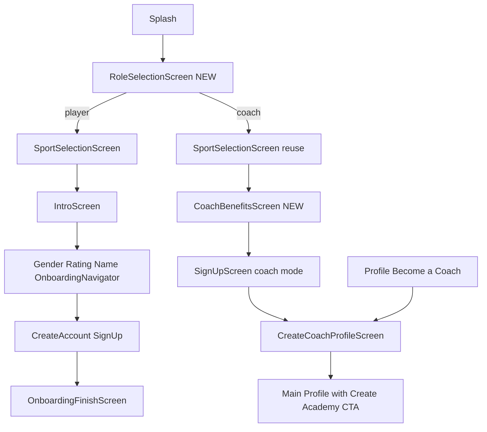

# Onboarding v2 — Player & Coach Flows

## Spec vs current codebase

The v2 spec in [`onboarding-user-flows-v2 (1).md`](<onboarding-user-flows-v2 (1).md>) is largely achievable by **extending** what already exists rather than greenfield work.

| Spec item | Current state | Action |
|-----------|---------------|--------|
| `RoleSelectionScreen` | Missing | **New screen** |
| `SportSelectionScreen` | Exists at step 0 | Move after role; reuse for both paths |
| Player path (Intro → Finish) | Fully wired in [`App.js`](App.js) | Keep; gate only when `role === 'player'` |
| `CoachBenefitsScreen` | Missing | **New screen** (clone [`IntroScreen.js`](src/screens/IntroScreen.js) pattern); slide 3 gets Sign In link |
| Coach sign-up & sign-in | [`SignUpScreen.js`](src/screens/SignUpScreen.js) and [`AuthScreen.js`](src/screens/AuthScreen.js) exist | **Reuse as-is** for both paths; no new auth screens; pass `mode: 'coach'` via params only |
| `CoachProfileScreen` | Implemented as [`CreateCoachProfileScreen.js`](src/screens/CreateCoachProfileScreen.js) (~2200 lines, matches spec fields) | Reuse; sport-aware rating pass only |
| Profile → Become a Coach | Already in [`ProfileScreen.js`](src/screens/ProfileScreen.js) L646–658 | Align copy/routing only |
| Create Academy popup | [`StartAcademyModal.js`](src/components/StartAcademyModal.js) (name + slug + logo URL) | Reuse; rename CTA to **Create Academy** per spec |
| Dashboard access resolution | [`AdminRoute.js`](src/components/AdminRoute.js) already checks admin → manager → coach | No structural change; C9a adds role check to `handleAuthenticate` |
| Padel Playtomic | [`sportConfig.js`](src/lib/sportConfig.js) still uses `padel_level` 1.0–10.0 | **Update config + validation** |
| `coaches.is_active` | Defaults `true` on save; [`checkCoachAccess`](src/lib/supabase.js) requires `is_active=true` | Active on save; review gates directory only (decided) |
| Returning coach sign-in (C9a) | `handleAuthenticate` hardcodes player Main + pickleball | **Make role-aware**: check `coaches` row → route to Profile; no coaches row → existing player behavior |



---

## Phase 1 — Role state & gate logic

### 1.1 Extend `UserContext`

File: [`src/context/UserContext.js`](src/context/UserContext.js)

Add to `DEFAULT_USER`:
- `role: null` (`'player' | 'coach'`)

Add onboarding flags (persisted in `@academypro_onboarding_state`):
- `hasSelectedRole`
- `hasCompletedCoachBenefits` (coach branch equivalent of `hasCompletedIntro`)
- `hasCompletedCoachProfile` (coach onboarding complete)

Add handlers:
- `completeRoleSelection(role)` — sets `user.role`, `hasSelectedRole`
- `resetRoleSelection()` — back from sport selection
- `completeCoachBenefits()` / `resetCoachBenefits()`
- `completeCoachProfile()` — marks coach onboarding done

**Migration:** existing users without `role` in saved state → treat as `player` with `hasSelectedRole: true` if they already passed sport/intro flags (avoid forcing re-onboarding).

### 1.2 Update step constants

File: [`src/lib/onboardingSteps.js`](src/lib/onboardingSteps.js)

Add `ROLE: -1` or keep as pre-step (like current `SPORT`). Coach path does not use numbered progress bar per spec.

### 1.3 Refactor `App.js` gate order

File: [`App.js`](App.js)

Replace current first gate (`!hasSelectedSport`) with role-aware branching per spec table:

```
!hasSelectedRole           → RoleSelectionScreen
!hasSelectedSport          → SportSelectionScreen (both roles)
role=player && !hasCompletedIntro     → IntroScreen
role=coach && !hasCompletedCoachBenefits → CoachBenefitsScreen
role=player && !hasSelectedGender     → GenderSelectionScreen
... (existing player gates)
role=coach && authenticated && !hasCompletedCoachProfile → CreateCoachProfileScreen
```

**Authenticated coach new user** (signed up on coach path): after auth, show `CreateCoachProfileScreen` as root (mirror Branch 2 pattern used for player `OnboardingFinishScreen`), then Main/Profile on complete.

**Returning sign-in** (`handleAuthenticate`): keep skip-all behavior; do **not** overwrite `sportId`/`role` if already persisted. Fix current hardcoded `completeSportSelection('pickleball')` in [`App.js` L218–227](App.js).

---

## Phase 2 — New screens

### 2.1 `RoleSelectionScreen` (new)

File: `src/screens/RoleSelectionScreen.js`

Content from spec C1:
- Title: **How will you use AcademyPro?**
- Cards: **Player** / **Coach**
- No back button
- Styled like [`SportSelectionScreen.js`](src/screens/SportSelectionScreen.js) (card grid + theme)

On select: `completeRoleSelection('player' | 'coach')`.

### 2.2 `CoachBenefitsScreen` (new)

File: `src/screens/CoachBenefitsScreen.js`

Reuse carousel structure from [`IntroScreen.js`](src/screens/IntroScreen.js):
- 3 slides with copy from spec C3
- CTAs: Next / Get Started + Sign In on last slide
- Back label: **Sport** → `resetSportSelection()`

**Assets:** start with existing onboarding images as placeholders:
- Slide 1: `assets/images/onboarding/slide_coaches.jpg`
- Slides 2–3: `slide_program.png` / dashboard-style placeholder until design assets land

Register slides in a new `coachBenefitSlides` array in [`sportConfig.js`](src/lib/sportConfig.js) or a small `src/lib/coachOnboardingConfig.js` (keep sport-agnostic per spec).

### 2.3 Coach onboarding navigator

File: `src/navigation/CoachOnboardingNavigator.js` (new, mirrors [`OnboardingNavigator.js`](src/navigation/OnboardingNavigator.js))

Stack:
1. `CoachBenefits` → on complete navigate to `SignUp`
2. `SignUp` — pass `mode: 'coach'` and `sportId` via route params

**Reuse `SignUpScreen` exactly as-is.** The spec explicitly defers the question of one merged screen vs two and says both existing screens get reused rather than rebuilt. Only the route params differ:
- Coach mode payload: `{ role: 'coach', sportId, name }` (no gender/rating/goal/time/intensity)
- Player payload: unchanged from v1

`CoachBenefitsScreen` slide 3 "Sign In" link → navigates to `AuthScreen` (same as player `IntroScreen` pattern).

---

## Phase 3 — Player path adjustments (minimal)

Only two changes beyond role gate:

1. **Sport selection** runs after role, not first — already handled by gate reorder.
2. **Padel Playtomic** in rating step (see Phase 4).

No changes to [`OnboardingNavigator.js`](src/navigation/OnboardingNavigator.js) screen sequence.

Optional follow-up (not blocking v2): fix [`TimeCommitmentScreen.js`](src/screens/TimeCommitmentScreen.js) to use `getSportSkills(sportId)` instead of hardcoded pickleball `Commun_skills_tags.json` (known v1 gap).

---

## Phase 4 — Padel Playtomic rating

File: [`src/lib/sportConfig.js`](src/lib/sportConfig.js)

Update `padel.ratingSystem`:
```js
type: 'playtomic',
label: 'Playtomic',
min: 0.0,
max: 7.0,
placeholder: 'e.g., 3.500',
inputHint: 'Rating should be between 0.0 and 7.0',
dbColumn: 'skill_rating',
```

Update `padel.ratingOptions` to mirror DUPR copy pattern (spec player section):
- "Enter your official Playtomic rating" / "I don't have a rating" / "I'm new to padel"
- Default fallback rating: `0.0` (or sport config `min`)

**Downstream touchpoints:**
- [`RatingSelectionScreen.js`](src/screens/RatingSelectionScreen.js) — already sport-config-driven; no logic change if config updated
- [`CreateCoachProfileScreen.js`](src/screens/CreateCoachProfileScreen.js) — replace hardcoded DUPR field with `getSport(user.sportId).ratingSystem` (label, placeholder, validation, auto-populate from `skill_rating` for padel)
- [`ProfileScreen.js`](src/screens/ProfileScreen.js) edit-rating modal — already sport-config-driven

---

## Phase 5 — Coach profile & post-onboarding landing

### 5.1 `CreateCoachProfileScreen` (existing)

Spec says "visual pass only, no rebuild." Required wiring:

- Accept onboarding context: pre-fill name/email from auth; use `user.sportId` for sport name in intro copy ("Share your **padel** expertise…")
- Sport-aware rating field (DUPR vs Playtomic) per spec C5 table
- On save from **coach onboarding** (not edit from Profile): call `completeCoachProfile()` then navigate to **Profile** tab (not just `goBack()`)
- **`is_active: true` on save** (your decision); **`is_verified: false`**; directory publish remains off by default (`is_accepting_students: false`)

### 5.2 Profile landing (spec C6–C8)

File: [`ProfileScreen.js`](src/screens/ProfileScreen.js)

- Rename **Start Your Academy** → **Create Academy** (L640)
- After coach onboarding save, ensure Profile shows:
  - **Create Academy** CTA (coaches who are not managers)
  - **Become a Coach** hidden once coach row exists (already conditional on `isCoach`)
- [`StartAcademyModal.js`](src/components/StartAcademyModal.js): keep existing fields (name, slug, logo); sport is implicit from coach's `sportId` (no UI change needed for v2)

### 5.3 Dashboard access (spec C9)

No code change to priority order in [`AdminRoute.js`](src/components/AdminRoute.js).

With `is_active=true` on save, new coaches immediately satisfy priority 3 and see **Coach Dashboard** in Profile settings — matching your decision.

Document in code comment: manual review gates `is_verified` / directory publish, not dashboard access.

---

## Phase 6 — Auth shortcuts, returning coach (C9a), & edge cases

### 6.1 Sign In shortcuts (both paths)

Both `IntroScreen` (player) and `CoachBenefitsScreen` (coach) slide 3 have a "Sign In" link pointing at the existing `AuthScreen`. No new screen needed — `AuthScreen` is already shared.

### 6.2 Returning coach sign-in — `handleAuthenticate` (spec C9a)

The current [`App.js`](App.js) `handleAuthenticate()` handler blindly sets all player flags, forces `sportId` to pickleball, and routes everyone to Main. The spec calls this a gap for coaches.

**Updated behavior:**

After a successful auth event, before marking onboarding complete, check if the authenticated user has a `coaches` row (query `checkCoachAccess(userId)`):

```
coaches row exists (any is_active status)
  → mark all onboarding flags done
  → set user.role = 'coach' if not already set
  → route to Profile tab (not Main)
    Profile resolves Admin → Academy → Coach Dashboard per C9 priority table

no coaches row
  → existing player behavior unchanged (mark flags done, route to Main)
```

This reuses `checkCoachAccess` (already imported everywhere) and the same C9 priority logic already in `AdminRoute.js` / `ProfileScreen.js` — no new DB queries or screens required.

The pending-metadata merge (stashing onboarding data before OAuth) stays scoped to sign-up only, unchanged from v1. `AuthScreen` sign-ins do not merge onboarding data.

### 6.3 Edge cases

| Scenario | Behavior |
|----------|----------|
| Sign In from Intro slide 3 (player) | `AuthScreen` → C9a check → no coaches row → Main |
| Sign In from Benefits slide 3 (coach) | `AuthScreen` → C9a check → coaches row → Profile |
| New coach: signs up, no coaches row yet | SignUp → `CreateCoachProfileScreen` gate (authenticated + `!hasCompletedCoachProfile`) |
| Existing player → Become a Coach | Profile → `CreateCoachProfile` route; no onboarding flags reset |
| Coach backs out to Role screen | `resetRoleSelection()` clears `hasSelectedSport` + `hasCompletedCoachBenefits` |
| Guest completes player flow without auth | Existing guest → Main unchanged |

Update [`SignUpScreen.js`](src/screens/SignUpScreen.js) to read `route.params.mode === 'coach'` and merge `role: 'coach'` into sign-up payload. No visual changes to `SignUpScreen` — params only.

---

## Phase 7 — Documentation

- Copy [`onboarding-user-flows-v2 (1).md`](<onboarding-user-flows-v2 (1).md>) → [`docs/onboarding-user-flows-v2.md`](docs/onboarding-user-flows-v2.md) as the canonical spec
- Annotate resolved open items in place:
  - `is_active=true` on save (review gates directory only)
  - Playtomic 0.0–7.0
  - Sign-up/sign-in: two existing screens reused, no merge
  - C9a returning coach: `checkCoachAccess` → Profile
- Leave deferred: multi-sport coach, paywall, exact academy popup fields, merged sign-up screen

---

## Files to create (3 new files only)

| File | Purpose |
|------|---------|
| `src/screens/RoleSelectionScreen.js` | Player / Coach role fork |
| `src/screens/CoachBenefitsScreen.js` | Coach intro carousel (3 slides, Sign In on slide 3) |
| `src/navigation/CoachOnboardingNavigator.js` | Benefits → existing `SignUpScreen` stack |

## Files to modify (primary)

| File | Change |
|------|--------|
| [`App.js`](App.js) | Role-aware gates; C9a returning-coach check in `handleAuthenticate`; remove hardcoded pickleball default |
| [`src/context/UserContext.js`](src/context/UserContext.js) | `role` + `hasSelectedRole` + coach benefit/profile flags + handlers; migration for existing users |
| [`src/lib/sportConfig.js`](src/lib/sportConfig.js) | Padel → Playtomic 0.0–7.0 config |
| [`src/lib/onboardingSteps.js`](src/lib/onboardingSteps.js) | Add `ROLE` pre-step constant |
| [`src/screens/SignUpScreen.js`](src/screens/SignUpScreen.js) | Read `route.params.mode === 'coach'`; merge `role: 'coach'` into payload; no visual changes |
| [`src/screens/CreateCoachProfileScreen.js`](src/screens/CreateCoachProfileScreen.js) | Sport-aware rating field (DUPR/Playtomic); route to Profile after save from onboarding |
| [`src/screens/ProfileScreen.js`](src/screens/ProfileScreen.js) | Rename "Start Your Academy" → "Create Academy" |

**Not changing:** [`AuthScreen.js`](src/screens/AuthScreen.js), [`OnboardingNavigator.js`](src/navigation/OnboardingNavigator.js), [`AdminRoute.js`](src/components/AdminRoute.js), [`StartAcademyModal.js`](src/components/StartAcademyModal.js) — all reused as-is.

## Test plan

1. **New player pickleball:** Role → Player → Sport → full player path → OnboardingFinish → Main
2. **New player padel:** Same; verify Playtomic copy, 0.0–7.0 validation, default on "no rating"
3. **New coach pickleball:** Role → Coach → Sport → Benefits (3 slides) → existing SignUpScreen → CoachProfile → Profile with Create Academy + Coach Dashboard visible
4. **New coach padel:** Same; verify Playtomic field on coach profile form
5. **Existing player → Become a Coach:** Profile → form → save → Create Academy visible; no re-onboarding
6. **Returning coach sign-in (C9a):** Sign In from Benefits slide 3 → `AuthScreen` → `checkCoachAccess` finds coaches row → Profile (not Main)
7. **Returning player sign-in:** Sign In from Intro → `AuthScreen` → no coaches row → Main (unchanged)
8. **Back navigation:** Role ← Sport ← Benefits/Intro resets correct flags at each step
