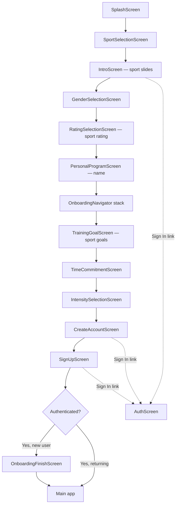

# Onboarding User Flows — Pickleball & Padel

Reference for how new users move through AcademyPro onboarding, what each screen shows, and where sport selection (pickleball vs padel) changes the experience.

---

## Overview

AcademyPro uses a **multi-sport onboarding architecture**. The user picks a sport first; everything downstream reads from `src/lib/sportConfig.js` via `getSport(user.sportId)`.

| Sport | Status | Rating system | Fun game (6-point doubles) |
|-------|--------|---------------|----------------------------|
| **Pickleball** | Live | DUPR (2.0–8.0) | Enabled |
| **Padel** | Live | Level (1.0–10.0) | Disabled |

Both sports share the same screen sequence. Copy, intro slides, goals, and rating options differ per sport.

---

## High-level flow

### Pre-auth gate order (`App.js`)

For users who are **not signed in**, `App.js` picks the first incomplete flag:

| Order | Flag | Screen |
|-------|------|--------|
| 0 | `!hasSelectedSport` | `SportSelectionScreen` |
| 1 | `!hasCompletedIntro` | `IntroScreen` |
| 2 | `!hasSelectedGender` | `GenderSelectionScreen` |
| 3 | `!hasSetRating` | `RatingSelectionScreen` |
| 4 | `!hasSetName` | `PersonalProgramScreen` |
| 5 | `!hasCompletedOnboarding` | `OnboardingNavigator` (goal → account) |
| 6 | complete | `MainTabNavigator` (guest path) |

### Post-auth paths

| User type | Route |
|-----------|-------|
| **New user** (signed up during onboarding) | `OnboardingFinishScreen` → program picker → Main |
| **Returning user** (Sign In from Intro / Create Account) | Skips remaining onboarding → Main directly |

Returning sign-in calls `handleAuthenticate()` in `App.js`, which marks all onboarding flags complete and defaults `sportId` to **pickleball** (does not preserve a sport picked before sign-in unless already persisted).

---

## Onboarding steps & progress bar

Numbered steps (used by `OnboardingShell` progress bar) are defined in `src/lib/onboardingSteps.js`:

| Step # | Key | Screen |
|--------|-----|--------|
| 0 | `SPORT` | Sport selection (pre-step, no progress bar) |
| — | — | Intro carousel (no progress bar) |
| 1 | `GENDER` | Gender selection |
| 2 | `RATING` | Rating selection |
| 3 | `NAME` | Name input |
| 4 | `GOAL` | Training goal |
| 5 | `TIME` | Time commitment |
| 6 | `INTENSITY` | Session intensity |
| 7 | `CREATE_ACCOUNT` | Create account |
| 8 | `SIGNUP` | Email sign-up form |

Progress = `step / 8 × 100%`.

---

## Screen-by-screen content

### 0. SplashScreen

**File:** `src/screens/SplashScreen.js`  
**Sport-specific:** No  
**Duration:** ~1.8s animated splash, then auto-advances.

| Element | Content |
|---------|---------|
| Title | **AcademyPro** |
| Visual | Animated logo / gradient (warm theme) |

---

### 1. SportSelectionScreen

**File:** `src/screens/SportSelectionScreen.js`  
**Sport-specific:** Entry point — sets `user.sportId`  
**Back button:** None (first step)

| Element | Content |
|---------|---------|
| Title | **Choose your sport** |
| Subtitle | Pick your primary sport to personalise your experience |
| Cards | **Pickleball** — Tap to get started |
| | **Padel** — Tap to get started |
| Footer | More sports coming soon |

**Card images**

| Sport | Asset |
|-------|-------|
| Pickleball | `assets/images/intro.png` |
| Padel | `assets/images/onboarding/slide_program_padel.jpeg` |

**On select:** `completeSportSelection(sportId)` → persists `sportId` to `UserContext` / AsyncStorage.

---

### 2. IntroScreen

**File:** `src/screens/IntroScreen.js`  
**Sport-specific:** Slides loaded from `getSport(sportId).introSlides`  
**Back:** “Sport” → resets sport selection

Three horizontal slides with shared layout: hero image + title + subtitle + dot indicators.

**CTAs**

| Slide | Primary button | Secondary |
|-------|----------------|-----------|
| 1–2 | **Next** | — |
| 3 (last) | **Get Started** | **Sign In** (navigates to `AuthScreen`) |

#### Pickleball slides

| # | Title | Subtitle | Image |
|---|-------|----------|-------|
| 1 | Your beautiful training journal | Track mood, skills, and every session in one place | `slide_logbook.jpg` |
| 2 | Get trained by certified Pros | Follow programs from top coaches and level up faster | `intro.png` |
| 3 | Free DUPR Program to 4.0+ | Structured path matched to your rating — start today | `slide_program.png` |

#### Padel slides

| # | Title | Subtitle | Image |
|---|-------|----------|-------|
| 1 | Your beautiful training journal | Track mood, skills, and every **padel session** in one place | `slide_logbook.jpg` |
| 2 | Get trained by certified Pros | Follow programs from top **padel coaches** and level up faster | `intro.png` |
| 3 | Your personalized Padel Program | Structured path matched to your **level** — start today | `slide_program_padel.jpeg` |

---

### 3. GenderSelectionScreen

**File:** `src/screens/GenderSelectionScreen.js`  
**Sport-specific:** No (theme only)  
**Step:** 1 / 8

| Element | Content |
|---------|---------|
| Title | **Tell us about yourself** |
| Subtitle | Pick your style — we'll personalize your training journal |
| Options | **Female** / **Male** (photo cards) |
| Hint (default) | Female = warm light · Male = sporty dark |
| Hint (female selected) | Warm & friendly theme applied |
| Hint (male transition) | Sport dark theme applied |

**Behavior**

- **Female:** warm light logbook theme → auto-advance ~450ms after tap.
- **Male:** 2s animated transition to dark sporty theme → advance.
- **Back:** returns to Intro (`goBackToIntro()`).

**Saved:** `{ gender: 'female' | 'male' }`

---

### 4. RatingSelectionScreen

**File:** `src/screens/RatingSelectionScreen.js`  
**Sport-specific:** Options, labels, validation from `sport.ratingSystem` and `sport.ratingOptions`  
**Step:** 2 / 8

| Element | Content |
|---------|---------|
| Title | **What's your rating?** |
| Subtitle | Help us personalize your training experience |

#### Pickleball

| Option | Title | Description |
|--------|-------|-------------|
| Has rating | Enter your official DUPR rating | I have an official DUPR account |
| No rating | I don't have a rating | I'm new to pickleball |

**If DUPR selected**

- Label: Enter your **DUPR** rating
- Placeholder: `e.g., 3.500`
- Hint: Rating should be between **2.0 and 8.0**
- Button: **Continue**

**If no rating**

- Info: We'll start you at rating **2.0**. You can update this anytime in your profile.

#### Padel

| Option | Title | Description |
|--------|-------|-------------|
| Has level | Enter your padel level | I know my current level (1–10) |
| No level | I don't have a level | I'm new to padel |

**If level selected**

- Label: Enter your **Level** rating
- Placeholder: `e.g., 4.5`
- Hint: Level should be between **1.0 and 10.0**

**If no level**

- Info: We'll start you at rating **1.0**.

**Back:** resets gender selection and theme to light.

---

### 5. PersonalProgramScreen (name)

**File:** `src/screens/PersonalProgramScreen.js`  
**Sport-specific:** No  
**Step:** 3 / 8

| Element | Content |
|---------|---------|
| Title | **What's your name?** |
| Subtitle | Tell us a bit about yourself so we can design training that fits your goals. |
| Input placeholder | Enter your first name |
| Button | **Continue** (disabled until name entered) |

**Back:** resets rating step.

---

### 6. TrainingGoalScreen

**File:** `src/screens/TrainingGoalScreen.js` (inside `OnboardingNavigator`)  
**Sport-specific:** Title + goal list from sport config  
**Step:** 4 / 8

| Element | Pickleball | Padel |
|---------|------------|-------|
| Title | **What's your pickleball goal?** | **What's your padel goal?** |
| Subtitle | Let's personalize your training experience | (same) |

#### Pickleball goals

| ID | Title | Description |
|----|-------|-------------|
| `dupr` | Improve my DUPR rating | Level up and climb the rankings |
| `basics` | Learn the basics | Master fundamentals from zero to 3.0 |
| `consistency` | Get more consistent in matches | Reduce errors and play smarter |
| `tournament` | Compete in tournaments | Prepare for competitive play |

#### Padel goals

| ID | Title | Description |
|----|-------|-------------|
| `ranking` | Improve my ranking | Climb the padel ladder and compete higher |
| `basics` | Learn the basics | Master fundamentals from serve to wall play |
| `consistency` | Get more consistent | Reduce errors and build reliable shot patterns |
| `tournament` | Compete in tournaments | Prepare for competitive padel circuits |

**Back:** returns to name step (`resetNameSelection`).

---

### 7. TimeCommitmentScreen

**File:** `src/screens/TimeCommitmentScreen.js`  
**Sport-specific:** No (shared options)  
**Step:** 5 / 8

| Element | Content |
|---------|---------|
| Title | **How often can you train?** |
| Subtitle | We'll create a plan that fits your schedule |

| ID | Title | Description | Badge |
|----|-------|-------------|-------|
| `low` | 1–2 hours per week | Perfect for busy schedules | 1-2h |
| `medium` | 3–4 hours per week | Steady improvement pace | 3-4h |
| `high` | 5+ hours per week | Accelerated training mode | 5+h |

**Note:** Selecting a time option also auto-sets `focus_areas` to all skill IDs from the legacy pickleball skills file (`Commun_skills_tags.json`). Padel-specific focus assignment is not yet wired here.

---

### 8. IntensitySelectionScreen

**File:** `src/screens/IntensitySelectionScreen.js`  
**Sport-specific:** No  
**Step:** 6 / 8

| Element | Content |
|---------|---------|
| Title | **How intense should your sessions be?** |
| Subtitle | Choose the training intensity that fits your lifestyle |

| ID | Title | Duration | Description | Badge |
|----|-------|----------|-------------|-------|
| `short` | Light & simple | ~20 min | 2 drills/session | QUICK |
| `balanced` | Balanced | ~30–40 min | 3 drills/session | RECOMMENDED |
| `full` | Challenging | ~45–60 min | 4+ drills/session | — |

**Benefits shown per card**

- **Light:** Perfect for busy schedules · Easy to stay consistent
- **Balanced:** Good variety & progress · Manageable time commitment
- **Challenging:** Maximum skill development · Comprehensive training

---

### 9. CreateAccountScreen

**File:** `src/screens/CreateAccountScreen.js`  
**Sport-specific:** No  
**Step:** 7 / 8

| Element | Content |
|---------|---------|
| Title | **Create an account** |
| Subtitle | Save your workouts, progress, settings, and more. |
| Social | Google / Apple sign-in (`SocialAuthButtons`) |
| Divider | or |
| Email CTA | **Register via email** |
| Legal | By continuing you are agreeing to AcademyPro's **Privacy Policy** and **Terms of Service** |
| Footer | Already have an account? **Sign In** |

Social sign-in stores pending onboarding metadata (name, goal, time, intensity) for profile merge after OAuth.

---

### 10. SignUpScreen

**File:** `src/screens/SignUpScreen.js`  
**Sport-specific:** No  
**Step:** 8 / 8

| Element | Content |
|---------|---------|
| Title | **Create Account** |
| Subtitle | Join AcademyPro and start your training journey |
| Fields | Name · Email · Password (with strength indicator) |
| Button | **Create Account** |
| Footer | Already have an account? **Sign In** |

Sign-up payload includes all collected onboarding data (`getOnboardingData()`): sport, gender, rating, goal, time, intensity, name, etc.

---

### 11. AuthScreen (shortcut — not in main sequence)

**File:** `src/screens/AuthScreen.js`  
**Reachable from:** Intro slide 3, Create Account, Sign Up  
**Progress bar:** Hidden

| Element | Content |
|---------|---------|
| Title | **Welcome Back** |
| Subtitle | Sign in to continue your training |
| Social | Google / Apple |
| Email/password | Sign in form |
| Links | Forgot password · Sign Up |

**Returning user:** skips onboarding finish and lands on Main.

---

### 12. OnboardingFinishScreen (post-sign-up only)

**File:** `src/screens/OnboardingFinishScreen.js`  
**When shown:** Authenticated + onboarding flags complete + first-time finish gate  
**Sport-specific:** Program matching uses goal + rating (mock logbook preview uses pickleball skill IDs)

#### Step 1 — Logbook hero preview

| Element | Content |
|---------|---------|
| Title | **Your beautiful training journal** |
| Subtitle | Log mood after every session. See which skills you're building — automatically. |
| Mock cards | 7h this month donut · mood timeline · skill patterns (dinks, returns, serves, drops) |
| CTA | **Next** |

#### Step 2 — Program picker

| Element | Content |
|---------|---------|
| Title | **Pick your free program** |
| Subtitle | We matched these to your goal. You can change anytime. |
| Sections | Recommended for you · Other options |
| Primary CTA | **Start my program** |
| Secondary | **Skip for now** |

On complete → Main app, **My Training** tab, optional enrolled program.

---

## Pickleball vs Padel — what changes downstream

| Area | Pickleball | Padel |
|------|------------|-------|
| **Sport selection card** | `intro.png` | `slide_program_padel.jpeg` |
| **Intro slide 3** | Free DUPR Program to 4.0+ | Your personalized Padel Program |
| **Rating label** | DUPR (2.0–8.0) | Level (1.0–10.0) |
| **DB rating column** | `dupr_rating` | `skill_rating` |
| **Training goals** | DUPR-focused + pickleball copy | Ranking + wall play copy |
| **Skills taxonomy** | `src/data/sports/pickleball/skills.json` | `src/data/sports/padel/skills.json` |
| **Logbook quick skills** | serves, returns, dinks, volleys, drops, third_shot | serve, volley, lob, bandeja, wall_shot, vibora |
| **Assessment first Q** | Have you ever played Pickleball? | Have you ever played Padel? |
| **6-point doubles game** | Available | Hidden (`funGameEnabled: false`) |
| **AI program tiers** | DUPR tier cutoffs | Level tier cutoffs |

### Padel skills (truncated (first 8 — same order used if `FocusAreasScreen` were enabled)

Serve · Bandeja · Víbora · Lob · Volley · Smash · Wall Shot · Bajada

### Pickleball skills (first 8 from taxonomy)

Dinks · Drives · Serves · Returns · Volleys · Drops · Third Shot · Lobs

---

## Legacy / unused in current flow

| Screen | Status |
|--------|--------|
| `FocusAreasScreen` | Implemented but **not** in `OnboardingNavigator` or `App.js` gate. Skill focus is auto-assigned in `TimeCommitmentScreen`. |
| `ProgramLoadingScreen` | Standalone welcome carousel; not wired into the current onboarding gate. |
| `CoachingPreferenceScreen` | Not in current stack. |
| `CommitmentVisualizationScreen` | Not in current stack. |

---

## State & persistence

| Data | Where stored |
|------|--------------|
| Onboarding flags | AsyncStorage `@academypro_onboarding_state` (dual-read from legacy `@picklepro_*`) |
| `sportId`, gender, rating, goal, etc. | `UserContext` + persisted onboarding blob |
| Authenticated profile | Supabase `users.sport_id`, `dupr_rating` / `skill_rating` |

**Key context APIs:** `completeSportSelection`, `completeIntro`, `completeGenderSelection`, `updateUserRating`, `completeNameSelection`, `updateOnboardingData`, `completeOnboarding`.

---

## Source files

| Purpose | Path |
|---------|------|
| Sport registry (slides, goals, ratings) | `src/lib/sportConfig.js` |
| Gate logic & handlers | `App.js` |
| Step numbers | `src/lib/onboardingSteps.js` |
| Post-name stack | `src/navigation/OnboardingNavigator.js` |
| Shared layout | `src/components/onboarding/OnboardingShell.js` |
| User state | `src/context/UserContext.js` |
| Pickleball skills | `src/data/sports/pickleball/skills.json` |
| Padel skills | `src/data/sports/padel/skills.json` |

---

## Quick test paths

### New pickleball user (happy path)

Sport → Pickleball → Intro (3 slides) → Get Started → Female/Male → DUPR or no rating → Name → Goal → Time → Intensity → Create account → Sign up → OnboardingFinish → Main.

### New padel user

Same flow; choose **Padel** on first screen. Verify intro slide 3, padel goals, and level rating (1–10).

### Returning user

Intro → **Sign In** (or Create Account → Sign In) → Main (onboarding skipped; sport defaults to pickleball on sign-in handler).

### Change sport mid-flow

Intro → back **Sport** → pick other sport → intro slides refresh from new `sportId`.
