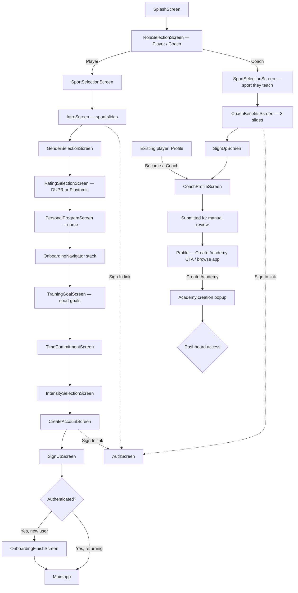

# Onboarding User Flows — Player & Coach

**Version 2.0 · July 11, 2026**

Reference for how new users move through AcademyPro onboarding, what each screen shows, and where role (player vs coach) and sport (pickleball vs padel) change the experience.

Supersedes v1 (player-only, pickleball & padel). Changes in this version: role selection moved to the top of the funnel, full coach path added, "Become a Coach" upgrade path for existing players, Create Academy flow, dashboard access resolution, and padel rating source switched from a generic manual "Level" to Playtomic.

---

## Overview

Onboarding now forks on **role** before it forks on **sport**. Role determines the entire downstream data model: a player answers gender, rating, goal, time commitment, and intensity questions that a coach never sees. Everything still reads from `src/lib/sportConfig.js` via `getSport(user.sportId)` on both paths.

| Sport | Status | Player rating system | Coach rating shown | Fun game (6-point doubles) |
|-------|--------|----------------------|---------------------|----------------------------|
| **Pickleball** | Live | DUPR (2.0–8.0) | DUPR | Enabled |
| **Padel** | Live | Playtomic | Playtomic | Disabled |

Padel's rating source changed from a generic self-reported "Level (1.0–10.0)" to Playtomic, the same pattern pickleball already uses with DUPR: enter an official rating if you have one, or start at a default and update later. This applies to both the player rating step and the coach profile's rating field.

---

## High-level flow

### Pre-auth gate order (`App.js`)

| Order | Flag | Screen |
|-------|------|--------|
| 0 | `!hasSelectedRole` | `RoleSelectionScreen` |
| 1 | `!hasSelectedSport` | `SportSelectionScreen` |
| 2 (player only) | `!hasCompletedIntro` | `IntroScreen` |
| 2 (coach only) | `!hasCompletedCoachBenefits` | `CoachBenefitsScreen` |
| 3 (player only) | `!hasSelectedGender` | `GenderSelectionScreen` |
| 4 (player only) | `!hasSetRating` | `RatingSelectionScreen` |
| 5 (player only) | `!hasSetName` | `PersonalProgramScreen` |
| 6 (player only) | `!hasCompletedOnboarding` | `OnboardingNavigator` (goal → account) |
| — (coach only) | `!hasCompletedCoachProfile` | `CoachProfileScreen` |
| 7 | complete | `MainTabNavigator` / Profile |

### Post-auth paths

| User type | Route |
|-----------|-------|
| **New player** (signed up during onboarding) | `OnboardingFinishScreen` → program picker → Main |
| **New coach** (signed up during onboarding) | `CoachProfileScreen` → Profile (Create Academy CTA visible, submitted for review) |
| **Existing player becoming a coach** | Profile → "Become a Coach" → `CoachProfileScreen` → Profile (same landing as above) |
| **Returning player** (Sign In from Intro / Create Account) | Skips remaining onboarding → Main directly |
| **Returning coach** (Sign In from `CoachBenefitsScreen` slide 3 / Create Account / Sign Up) | Skips onboarding → Profile, routed per dashboard resolution (see C9a) |

---

## Shared: Sign up / Log in

**Files:** `src/screens/SignUpScreen.js` and `src/screens/AuthScreen.js` (existing, reused as-is)
**Used by:** Both player and coach paths, plus every "Sign In" shortcut across onboarding

Both paths point at the same two existing screens rather than building new ones. Whether Cursor keeps them as two components or merges them into one with a mode toggle is an implementation decision, not something this doc prescribes, the point is no new screen gets built when a working one already exists.

| Screen | Used for |
|--------|----------|
| `SignUpScreen` | New account creation, player and coach paths both land here after their respective step sequences |
| `AuthScreen` | Returning users, reached via every "Sign In" link (Intro slide 3, `CoachBenefitsScreen` slide 3, and mid-signup) |

**Sign-up only:** pending onboarding metadata (name, goal, time, intensity for players; nothing extra for coaches) is stashed for merge after OAuth or on successful account creation, unchanged from v1. This stays scoped to sign-up, someone landing on `AuthScreen` to log back in doesn't get any pending onboarding data merged in.

**On successful auth:** routes per the Post-auth paths table above, new player → `OnboardingFinishScreen`, new coach → `CoachProfileScreen`, returning user of either role → resolved via C9a.

---

## Coach path

### C1. RoleSelectionScreen

**File:** `src/screens/RoleSelectionScreen.js` (new)
**Back button:** None (first step, replaces `SportSelectionScreen` as step 0)

| Element | Content |
|---------|---------|
| Title | **How will you use AcademyPro?** |
| Subtitle | This sets up the right experience for you |
| Cards | **Player** — Train, track progress, join a program |
| | **Coach** — Build your academy, manage students |

**On select:** `completeRoleSelection(role)` → persists `role` to `UserContext` / AsyncStorage. Determines which branch of the gate order runs next.

---

### C2. SportSelectionScreen (coach branch)

Reuses the existing `SportSelectionScreen` component from the player flow, same cards, same `completeSportSelection(sportId)` call. One sport per coach for now (one academy per sport); a coach who teaches multiple sports is an open question, not built yet.

---

### C3. CoachBenefitsScreen

**File:** `src/screens/CoachBenefitsScreen.js` (new)
**Sport-specific:** No
**Slides:** 3, same shared layout as the player `IntroScreen` (hero image + title + subtitle + dot indicators)

Positions the product as academy infrastructure, not a coach listing.

| # | Title | Subtitle | Image |
|---|-------|----------|-------|
| 1 | Anyone can coach. Winners build systems | Turn your coaching into a real academy, not just a profile. One brand, one standard, every session | hero: coach with multiple students on court |
| 2 | One curriculum. Every coach. Every student | Add coaches without losing what made you good. Every student gets the same progression, no matter who's teaching | dashboard mock: unified curriculum / progress tracking |
| 3 | Your academy. Your name. Your price | White-label from day one. You set the rate, you keep the students, you own the brand as you grow | mock: academy dashboard, student count, coach count |

**CTAs**

| Slide | Primary button | Secondary |
|-------|----------------|-----------|
| 1–2 | **Next** | — |
| 3 (last) | **Get Started** | **Sign In** (navigates to `AuthScreen`) |

---

### C4. SignUpScreen (coach branch)

Reuses the existing `SignUpScreen` component. Same fields (Name, Email, Password), same footer. No onboarding metadata to merge in (no gender/rating/goal/time/intensity collected on this path), payload is just the account plus `role: 'coach'` and `sportId`.

---

### C5. CoachProfileScreen

**File:** `src/screens/CoachProfileScreen.js`
**Reachable from:** Coach sign-up (new user) and Profile → "Become a Coach" (existing player)
**Status:** Already implemented (see reference screens), visual pass only, no rebuild

Header: **Create Coach Profile**, with a **Save** action.

Intro copy: **Earn More with AcademyPro** — *Share your [sport] expertise and help others improve their game. Fill out your profile to get started.*

**Basic Information**

| Field | Notes |
|-------|-------|
| Full Name * | Pre-filled from sign-up |
| Email Address * | Pre-filled from sign-up |
| Phone Number | Country code selector, auto-detected default |
| Preferred Messaging Apps * | WhatsApp / iMessage / Zalo, multi-select, at least one required |

**Bio**

| Field | Notes |
|-------|-------|
| Bio | Freeform: background, experience, coaching philosophy |

**Professional Details**

| Field | Pickleball | Padel |
|-------|------------|-------|
| Rating | **DUPR Rating** — auto-populated from player profile if the coach also has a player account, editable, x.xxx format, validated | **Playtomic Rating** — same pattern: auto-populated if available, editable, validated against Playtomic's scale |
| Hourly Rate (₫) | Typical range shown as a hint (e.g. 300,000–1,500,000₫/hour) | Same pattern |
| Location | City/State input + "Use My Location" | — |
| Coaching Radius | Pill selector: 500m / 1km / 2km / 5km / 10km / 15km / 20km / 30km | — |
| Specialties | Multi-select pills: Technique, Mental Game, Beginners, Advanced, Competition, Youth, Fitness, Strategy | — |

**Availability & Visibility**

| Field | Default |
|-------|---------|
| Available for new students | On |
| Publish my profile in the coach directory | Off |

**Profile Review & Publishing** (info panel, always shown)

> Your coach profile will be reviewed by our team before it can be published. This typically takes 1–2 business days. You can choose to publish your profile in the coach directory once it's approved, or keep it private until you're ready.

Manual review stays in place while the product is free, it gates directory visibility, not necessarily dashboard access (see Dashboard Access below, open item).

**On Save:** creates/updates the `coaches` row, submits for manual review, routes to Profile.

---

### C6. Profile — post-save landing (coach)

Same Profile screen used across the app. After a coach profile is saved, it shows:

- **Create Academy** CTA
- Otherwise, the user can just browse the app as normal

This is the shared landing state for both coach entry points, new coach sign-up and existing player using "Become a Coach."

---

### C7. Profile → "Become a Coach" (existing player upgrade path)

**Entry point:** Profile → Settings → **Become a Coach**

Routes directly into `CoachProfileScreen` (C5), same form, same fields, same save behavior. On save, lands back on Profile with the same Create Academy CTA as the new-coach path (C6). Both entry points converge on one form and one outcome, no separate coach-profile variant for upgraded players.

---

### C8. Academy creation

**Trigger:** Profile → **Create Academy** CTA

A popup (not a full screen) collecting basic academy info: academy name, and any additional fields to be defined. Sport is fixed to whatever the coach already selected, one academy per sport for now.

**On save:** dashboard access appears in Profile per the resolution table below.

**Open, not yet defined:** exact field list beyond academy name; what happens after the popup beyond dashboard access appearing.

---

### C9. Dashboard access resolution

Checked in priority order, first match wins:

| Priority | Requirement | Dashboard label |
|----------|-------------|------------------|
| 1 | Row in `admin_users` with `is_active = true` | Admin Dashboard |
| 2 | Row in `academy_members` with `role = 'manager'` | Academy Dashboard |
| 3 | Row in `coaches` with `is_active = true` | Coach Dashboard |
| — | None of the above | Access Denied |

**Open item:** if `coaches.is_active` only flips to `true` after manual review approval, a coach who just finished `CoachProfileScreen` has no row satisfying any of the three priorities yet, and would see Access Denied immediately after signing up. Needs a decision: either `is_active` goes true on save (review only gates directory visibility, not dashboard access), or a distinct "Pending review" state is added so this isn't indistinguishable from a denied/blocked account.

---

### C9a. Returning coach — sign in

**Entry points:** "Sign In" link on `CoachBenefitsScreen` slide 3, `CreateAccountScreen`, or `SignUpScreen` → `AuthScreen` (all shared with the player flow, no coach-specific auth screen).

The existing `handleAuthenticate()` handler (v1) marks all onboarding flags complete and routes every returning user into the player `Main` app, defaulting `sportId` to pickleball. That's a gap for coaches, it needs to become role-aware rather than always defaulting to `Main`.

**Updated behavior:**

1. On successful authentication, check whether the account has a `coaches` row (any status) or `role: 'coach'`.
2. If yes → skip player onboarding entirely, route to Profile.
3. Profile then resolves which dashboard to surface using the same priority table as C9 (Admin → Academy → Coach → Access Denied), so a returning coach lands wherever their current status actually puts them, not a fixed screen.
4. If no `coaches` row exists → unchanged player behavior, route to `Main`.

This reuses C9's resolution logic rather than introducing a separate returning-coach path, one source of truth for "where does this person land" whether they just finished onboarding or are signing back in later.

---

## Player path

Unchanged from v1 except where noted. Full screen-by-screen content (SplashScreen, IntroScreen, GenderSelectionScreen, RatingSelectionScreen, PersonalProgramScreen, TrainingGoalScreen, TimeCommitmentScreen, IntensitySelectionScreen, CreateAccountScreen, SignUpScreen, AuthScreen, OnboardingFinishScreen) carries over from v1 as-is. Two things changed:

1. **Entry point:** `SportSelectionScreen` is no longer step 0. It now runs after `RoleSelectionScreen`, only on the Player branch.
2. **Padel rating source (RatingSelectionScreen):** replaces the old generic "Level" option.

### Updated: RatingSelectionScreen — Padel

| Option | Title | Description |
|--------|-------|--------------|
| Has rating | Enter your official Playtomic rating | I have an official Playtomic account |
| No rating | I don't have a rating | I'm new to padel |

**If Playtomic selected**

- Label: Enter your **Playtomic** rating
- Hint: validated against Playtomic's scale
- Button: **Continue**

**If no rating**

- Info: We'll start you at a default rating. You can update this anytime in your profile.

This mirrors the DUPR pattern pickleball already uses (official rating with validation, or default fallback), rather than the old unanchored 1.0–10.0 manual "Level" slider. Downstream references to `skill_rating` / padel rating storage are unaffected by this change, only the input source and copy change.

---

## Pickleball vs Padel vs Coach — what changes downstream

| Area | Pickleball (player) | Padel (player) | Coach (either sport) |
|------|----------------------|------------------|------------------------|
| Rating system | DUPR (2.0–8.0) | Playtomic | DUPR or Playtomic, same field pattern |
| Onboarding length | 8 steps | 8 steps | 3 benefit slides + 1 profile form, no progress bar |
| Data collected | Gender, rating, goal, time, intensity, name | Same | Name, contact, messaging apps, bio, rating, rate, location, radius, specialties, availability |
| Post-signup landing | OnboardingFinishScreen → program picker | Same | Profile → Create Academy CTA |
| Review/approval gate | None | None | Manual review, 1–2 business days, before directory listing |

---

## Legacy / unused in current flow

Unchanged from v1: `FocusAreasScreen`, `ProgramLoadingScreen`, `CoachingPreferenceScreen`, `CommitmentVisualizationScreen` remain implemented but not wired into either gate.

---

## Open items (not blocking current build)

- Exact field list for the Academy creation popup beyond academy name
- What happens after Academy creation beyond dashboard access appearing in Profile
- Whether `coaches.is_active` should flip true on profile save vs. only after review approval (see C9)
- Whether a coach can eventually teach/coach more than one sport (one academy per sport is the current model)
- Payment and paywall logic for both solo coach and academy tiers, deferred until the flows above are stable
- Whether Cursor implements sign-up/log-in as one merged screen or keeps `SignUpScreen` and `AuthScreen` separate is an implementation detail, this doc only specifies that both existing screens get reused across the player and coach paths rather than new ones being built

---

## Source files

| Purpose | Path |
|---------|------|
| Sport registry (slides, goals, ratings) | `src/lib/sportConfig.js` |
| Gate logic & handlers | `App.js` |
| Step numbers | `src/lib/onboardingSteps.js` |
| Post-name stack (player) | `src/navigation/OnboardingNavigator.js` |
| Shared layout | `src/components/onboarding/OnboardingShell.js` |
| User state | `src/context/UserContext.js` |
| Coach profile form | `src/screens/CoachProfileScreen.js` |
| Role selection (new) | `src/screens/RoleSelectionScreen.js` |
| Coach benefits slides (new) | `src/screens/CoachBenefitsScreen.js` |
| Sign up (existing, reused by both paths) | `src/screens/SignUpScreen.js` |
| Sign in (existing, reused by both paths) | `src/screens/AuthScreen.js` |
